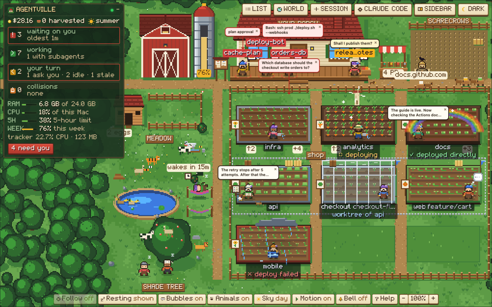
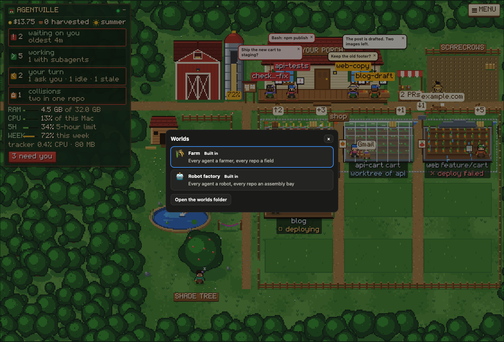
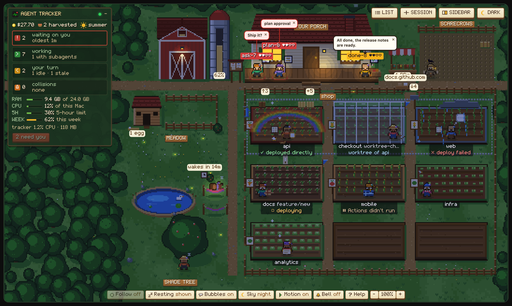

https://github.com/user-attachments/assets/803b91f8-a0ca-4ba8-835b-b889cefef32f


# Agentville

**Agentville is a live dashboard for every AI coding agent on your Mac**: Claude Code sessions (interactive
and background), their subagents and background jobs, and Codex. See who is waiting on you, what
each agent is doing right now and what it costs. Answer, message and steer them from one page,
and watch them work as farmers on a pixel farm.



<sub>The farm view, from a demo with made-up sessions. Every farmer is an agent and every field a
repo. Three farmers wait on your porch, one has finished, and the rest work in their fields with
the tool for their current step.</sub>

Everything runs on your machine. The collector is a small Node program with no dependencies.
It listens on `127.0.0.1` only and reads what Claude Code already writes to disk.

## Contents

- [What it can do](#what-it-can-do)
- [Requirements](#requirements)
- [Install](#install)
- [Using it](#using-it)
  - [The list view](#the-list-view)
  - [Answering and messaging agents](#answering-and-messaging-agents)
  - [Stopping a turn (■ Stop)](#stopping-a-turn--stop)
  - [Side questions (/btw)](#side-questions-btw)
  - [Notes for later](#notes-for-later)
  - [✨ Helper and suggested names](#-helper-and-suggested-names)
  - [Model, effort and permission mode](#model-effort-and-permission-mode)
  - [Starting, resuming, forking, ending and restarting sessions](#starting-resuming-forking-ending-and-restarting-sessions)
  - [Going back to an earlier point (↺ Restore)](#going-back-to-an-earlier-point--restore)
  - [⚙ Claude Code: plugins, MCP servers and permission rules](#-claude-code-plugins-mcp-servers-and-permission-rules)
  - [Files, documents and quoting](#files-documents-and-quoting)
  - [Worlds](#worlds)
    - [The farm](#the-farm)
  - [Notifications and the bell](#notifications-and-the-bell)
  - [Inside Claude Code: the mod](#inside-claude-code-the-mod)
- [Configuration](#configuration)
- [Commands](#commands)
- [How it works](#how-it-works)
- [Privacy and security](#privacy-and-security)
- [Troubleshooting](#troubleshooting)
- [Known limits](#known-limits)
- [Development](#development)
- [License](#license)

## What it can do

**See everything at once**
- Every Claude Code session on the Mac (terminal and background) and Codex, sorted by what needs
  you: **waiting on you**, **working**, **your turn**, **idle** and **stale**.
- What each one is doing right now: the tool it is running, the working line its terminal shows
  (`✻ Slithering… (5m 31s · ↓ 28.5k tokens · thinking with xhigh effort)`) and its recent steps.
- Its subagents, background jobs, task list, model, effort, permission mode, context left and
  cost so far.
- Your plan's usage (the 5-hour and weekly limits, and when they reset), and the CPU and memory
  your agents use.
- Collisions: two agents writing to the same repo at the same time.
- Each repo's branch, uncommitted files, unpushed commits, last deploy (GitHub Actions or a
  deploy an agent ran itself) and open pull requests.

**Respond without switching windows**
- Answer an agent's question (with its options) or a permission prompt (**Allow** / **Deny**), or
  cancel its questions as Esc does and tell it what you want instead.
- Message any session like a chat, with screenshots, PDFs or other files; it arrives as your own prompt.
  ↑ in the box brings back what you sent it before, as in its terminal.
- Read a session's whole conversation, from its first message, in a dialog you can search.
- Ask a session a side question (`/btw`) without interrupting or adding to its conversation.
- Keep notes on a session: things you may want to tell it later, or not. Put one in the message
  box to edit, or send it as it is. Notes stay after the session ends, and a fork gets a copy.

**Steer your sessions**
- Stop a session in the middle of its turn, as Esc does in its terminal: it stops what it was doing
  and waits for you.
- Fork a conversation from any message into a new session: from one of Claude's replies, or from
  just before one of your messages, which then waits in the new session's prompt box for you to change.
- Restore a session to before one of your messages, as `/rewind` does: its conversation, its code
  (the files Claude edited since), or both.
- Name a session with one click: a small Claude model (Haiku) suggests a short name from what it is
  working on, through your own Claude Code, only after you switch the ✨ Helper on.
- Start a new session in any folder of yours (type it, browse to it, or create it) or in one you've
  worked in, or find a past one (search, filter by folder, model, branch or running, sort by
  activity, start, name, folder or length) and resume it, in the permission mode, model and effort
  you choose.
- Switch a running session's model or effort, compact it, restart it in another permission mode,
  or end it (its terminal window closes too).
- See the shell commands each session runs right now (how long, CPU, memory), follow a background
  one's output, and stop one with everything it started.

**Manage Claude Code itself**
- See every plugin and skill with what it costs in context (always-on tokens per session), turn
  plugins on or off, update or uninstall them, and have running sessions reload them.
- Check every MCP server (yours, claude.ai connectors, each plugin's), sign in where needed, and
  remove the ones you configured. Review and remove permission rules.

**Read what they wrote**
- Browse an agent's folder with git status, its scratchpad and its memory (CLAUDE.md, auto
  memory, the summary it keeps after a compaction).
- Open specs and plans it wrote, quote a passage and reply about it.
- See pictures, PDFs, video, audio, HTML pages (as the page itself), Word documents and
  spreadsheets as themselves, not as code.
- Ask an agent for a screenshot or a screen recording: the file its reply names shows under the
  reply, and one click opens it.

**Get told when it matters**
- macOS notifications when an agent needs you, finishes, collides with another or runs hot.
- A bell in the page, and a count in the tab title.
- Inside Claude Code: a `/tracker` pane, a status line and toasts.

**Watch it as a farm, or a world of your own** (optional)
- Choose how the dashboard draws your agents: the farm, or a world of your own.
- A pixel farm where every agent is a farmer and every repo a field. Crops grow as context
  fills, weather shows the last deploy, a cart runs to town for each web call, each MCP server's
  cart drives to the farmer calling it, and you click
  the barn to start a session.
- Animals on the farm, just for fun: cows, goats, a sheepdog, an ostrich, a lion, a tiger and a duck
  family on the pond. Click one to pet or feed it, and a farmer walks over to do it. Now and then they
  get up to something (a goat steals a hat), react to deploys and merges, and huddle in winter.
- The farm is a world: it runs in a sandboxed frame of its own, with no access to the token, and
  asks the page for the little it needs ([docs/worlds.md](docs/worlds.md)). A world from your own
  folder sees no words or paths until you tick **Can see what agents say** for it.
- A test page that shows any world playing a tour of made-up snapshots, each situation at its own
  address for a screenshot, with no token and no real data; `npm run check-world` plays the same
  tour headless and names the file and line of what breaks.

## Requirements

- **macOS.** The service runs under launchd, and the tracker uses `ps` and `osascript`.
- **Node.js 22 or newer.** An nvm install is found automatically.
- **Claude Code.** The mod needs a build with plugin mods; it is tested on 2.1.293.
- **Optional: the GitHub CLI (`gh`)**, signed in, for deploy status and pull requests.

## Install

### 1. Get the code and the command

Its command keeps the project's first name, `agent-tracker`.

```bash
git clone https://github.com/hamsathul/agentville.git ~/tools/agentville
cd ~/tools/agentville
mkdir -p ~/.local/bin
ln -sf "$PWD/bin/agent-tracker" ~/.local/bin/agent-tracker   # ~/.local/bin must be on your PATH
```

### 2. Start the service

```bash
agent-tracker install     # a launchd service: starts now and at every login
agent-tracker status      # "http ok on :7777"
agent-tracker open        # opens http://localhost:7777
```

The dashboard already shows your sessions, their activity and their repos.

### 3. Load the mod in Claude Code (recommended)

The mod lets the dashboard answer, message and steer a session. It also reports the session's
cost, plan usage and working line. Add the `mod` folder to `~/.claude/settings.json`, using your
own clone path:

```json
{ "env": { "CLAUDE_CODE_PLUGIN_DIRS": "/Users/you/tools/agentville/mod" } }
```

New sessions load it. In a session that is already running, type `/reload-plugins`. A session
with the mod shows **📡 dashboard answers on** on the dashboard, and `/tracker` opens its pane.

### 4. Optional: deploys and pull requests

Install the GitHub CLI and sign in (`gh auth login`). The tracker then:
- shows open pull requests (with their checks) for every repo whose `origin` is on GitHub;
- shows the latest GitHub Actions run for the repos you list in `deployRepos` (see
  [Configuration](#configuration)).

A deploy an agent runs itself (a deploy script over ssh, `rsync`, `vercel --prod`…) shows without
`gh`.

### 5. Optional: settings

```bash
cp config.example.json config.json   # then edit; it is re-read when you save it
```

### First run: macOS permissions

- **Automation.** The first time you start, resume or end a session from the dashboard, macOS
  asks to let the tracker control Terminal (or iTerm). Allow it, or later under System Settings →
  Privacy & Security → Automation.
- **Notifications.** Allow notifications if macOS asks. The page's bell asks the browser
  separately, the first time you switch it on.

### Update and uninstall

```bash
cd ~/tools/agentville && git pull && agent-tracker restart   # update; then /reload-plugins in open sessions
agent-tracker uninstall                                          # remove the service
```

To remove it completely, also delete the `CLAUDE_CODE_PLUGIN_DIRS` entry from
`~/.claude/settings.json` and the clone folder.

## Using it

Open <http://localhost:7777>. **☰ List** at the top and the button beside it switch between the
two views: the list, and the world you chose (**🌾 Farm** until you choose another); the small **▾**
after them opens the list of worlds from either view. Both show the
same live data, updated every few seconds. A world fills the window, so it has its own **List**
button to come back; where one might not (any world of yours, and a built-in one that draws itself),
the page adds **World ▾** and **☰ List** in a corner.

### The list view

The page is laid out like an editor, in three columns:

- **Left: the agents.** Waiting ones come first, then the working ones with a live ticker of
  their current tool. Idle and stale agents fold away. Your repos sit below, each with its branch,
  last deploy, pull requests and the agents in it.
- **Centre: the agent you picked** (the one at work until you pick another). It shows:
  - its state, folder and model (a switch with `/model` shows at once, before its next reply);
  - its controls: permission mode, model, effort, Restart in…, End session;
  - CPU, memory, context left and cost;
  - **Now**: its working line and current tool, with **■ Stop** to end the turn as Esc does. When
    nothing is running it says since when it has been your turn and the first line of its last
    reply, or since when it has been idle or quiet;
  - **Commands running**: each shell command it (or a subagent) runs now, foreground or background,
    with how long it has run and its CPU and memory, everything it started included. **Output**
    shows a background one's output, followed while the dialog is open (a foreground one hands its
    output to the session when it ends). **■ Stop** asks first, then ends the command and everything
    it started. The session sees the command end;
  - the message box, side questions and the conversation, newest first, with the newest message
    framed in teal under a **Latest** tag (with your message, when it is right below it);
  - its activity, background jobs and workflows, the repos it touched and its process tree.
- **Its Subagents tab**, next to the agent's own while it has any, says how many, with a pulse
  while one is at work. Each subagent is a card: its type and task, running for how long or done
  in how long, how many steps, its step now (`🔧 Grep createOrder in src/`), and what it last said
  or its result. **▸** opens it to what it was asked, its steps and words (followed while it
  works) and its result; **⤢ Read** opens its whole transcript in the conversation dialog. A
  subagent that runs in the background stays *running* until Claude Code's notice says it finished.
- **Right: the explorer.** The agent's folder with git status letters (M, U, D) and a dot on files
  it edited or read, its **Scratchpad** and its **Memory**.

Along the top: your agents' memory and CPU, your plan's 5-hour and weekly usage, and four cards:
**Waiting on you**, **Working**, **Your turn** and **Collisions**. The tab title counts the agents
that need you, e.g. `(2) Agentville`, and the farmhouse in the tab gets a red light.

| State | Meaning |
|---|---|
| **waiting** | It needs you: a question, a plan to approve, or a permission prompt |
| **working** | It is busy |
| **your turn** | It finished its turn (if it asked you something, the question shows) |
| **idle** | Nothing happening |
| **stale** | No activity for a day (`staleAfterHours`) |

### Answering and messaging agents

These need the mod in that session.

- **Questions.** A waiting agent's question shows with its options, plus an "Other" box. Pick and
  send; the session carries on as if you had answered in its terminal.
  - **✕ Cancel** dismisses all its questions and stops the turn, as Esc does in the terminal. The
    session reads that you interrupted it; then send what you want instead from the message box. It
    needs mod 0.7.0, like **■ Stop**.
- **Permission prompts.** These show the command with **Allow** / **Always allow…** / **Deny**. The
  dashboard has the first 15 seconds (`permissionDashboardSec`); then the terminal asks as usual.
  **Always allow…** brings up Claude Code's own options for that call, the terminal's "Yes, and…"
  ones (always allow a rule in this project, access to a folder, accept edits for this session…),
  for 8 seconds: pick one and the call runs with it kept, exactly as Claude Code keeps it. Pick
  none and the terminal asks. It needs mod 0.6.0 or newer.
  - Only sessions whose mode can ask you (Ask first, Accept edits, Plan) offer prompts here. In
    bypass, don't-ask and auto mode the mode decides on its own, so a call goes straight on (mod
    0.6.2; an older mod held such calls for the 15 seconds, and the farmer went to the porch).
    In auto mode, a call its classifier hands to you is answered in the terminal.
- **Questions in replies.** When an agent ends its turn by asking something ("Should I push?"),
  it gets an "asks you" chip and a card, with one-click **Yes** / **No…** for yes/no questions.
- **Messages.** Type in the box under **Now** and press Enter (Shift+Enter for a new line). It
  arrives as your own prompt; a busy agent reads it when its current step ends.
- **↑ / ↓ recall what you sent**, as in the session's terminal. With the cursor on the box's first
  line, ↑ brings back your last message to that session, then the one before. ↓ on the last line
  goes forward again, and past the newest gives back what you were typing.
  - It recalls what you typed in the session's terminal or sent from the dashboard, read from its
    transcript.
  - Slash commands aren't recalled, as a message doesn't run them. Neither are files: a message
    comes back as its text.
- **Attachments.** Paste (⌘V), drop on the box or use 📎 Attach: any file (screenshots, PDFs,
  Markdown, text…), up to 6 of 10 MB each. The agent opens them with its Read tool.
- **📁 Folder** attaches a folder, picked in Finder's folder window. Nothing is uploaded: the
  message carries the folder's path, and the agent looks in it with its own tools.
- **Reply** on any of the agent's messages to quote it into yours. **Show all** loads the
  session's whole history, and **Full transcript** opens it in a new tab.
- **⤢ Read all**, on the Conversation heading, opens the whole conversation in a dialog: every
  message from the first, oldest first, read from the transcript however long it is. **Search**
  highlights every match in place, with "1 of 12" and ↑ ↓ (Enter for older, Shift+Enter for
  newer); it starts at the newest. While the dialog is open, new messages appear at the bottom.
  You can reply from it too: it has the same message box, with 📎 Attach and 📁 Folder, sharing the side
  panel's draft and files.

### Stopping a turn (■ Stop)

While a session works, its working line under **Now** has **■ Stop**. It ends the turn at once, as
Esc does in its terminal:
- The model stops, and a shell command it was running in the foreground ends. The session waits
  for you, and the dashboard shows it as *your turn*.
- The conversation stays. The session reads that it was interrupted, as after Esc, so you can tell
  it what to do instead.
- A message you sent while it worked isn't lost: it becomes the session's next prompt. That's the
  way to stop it and steer it at once.
- A command the model put in the background on purpose keeps running. Stop that one under
  **Commands running**, whose **■ Stop** ends a single command.
- There is no confirm, as Esc has none. It takes up to 2 seconds, since the mod checks for
  requests every 2 seconds.

It needs mod 0.7.0 or newer. For a session started before you updated, run `/reload-plugins` in
it.

### Side questions (/btw)

The **Side question** box asks the session something on the side, like `/btw` in its terminal.
It is answered from the conversation so far, with no tools, even while the session is busy, and
nothing is added to the conversation. The answer appears under the box.

Click the **Side question** heading to fold the whole section away, or to bring it back. Folded,
the heading shows how many side questions the session has. The choice holds for every session,
in the list and in the farm's sidebar, and is remembered.

### Notes for later

**Notes**, under the message box, is where you keep what you may want to tell a session later:
a thought while it works, the next step, a question for when it is done. Nothing in a note goes to
the session until you use it.

- Write a note in the box and press **Add** (↩ adds, ⇧↩ starts a new line). Each note is its own
  card, in the order you wrote them. Click a note's text to edit it (↩ saves, Esc cancels).
- **↳ Use** puts the note at the end of the message box, to change before you send it. Once that
  message is sent, the note counts as used. If you clear the box instead, it stays unused.
- **Send now** sends the note as it is, as your own message (queued if the session is busy), and
  marks it used.
- A used note stays, crossed out, so you can see what you have already said. **Clear used** removes
  them all; **✕** deletes one.
- You can write notes for any session on the dashboard, even one that isn't listening for the
  dashboard yet; **↳ Use** and **Send now** wait until it is.
- Notes belong to the session and stay after it ends. Resume it, or restore it, and they are there
  again; a fork gets a copy. In **＋ Session**, a past session with notes you haven't used shows 📝
  and how many.
- A session holds up to 200 notes of up to 4,000 characters each.
- Like Side question, the heading folds the section away and, folded, says how many notes are unused.

### ✨ Helper and suggested names

The **✨ Helper** does small writing jobs for the dashboard with Haiku, a small, fast Claude
model. It is **off until you switch it on**, in **✨ Helper** in the list view's header (or with ✨
beside a session's name while it is off, in the list or the farm's sidebar), and does only what you
tick there. The farm's own buttons have no ✨ Helper yet: to change it from the farm, go to the list
view.

- **How it calls Haiku:** through the Agentville mod inside one of your open Claude Code
  sessions, with your sign-in, on your Claude plan. There is no API key, nothing is added to any
  conversation, and no new session starts. With no session open, nothing is called.
- **Name suggestions** (its one use so far):
  - When a new session (started after you switched the helper on) has replied once and still
    has Claude Code's own name (such as `agent-tracker-9c`), its sidebar offers one:
    **Name it `login-bug`?** ✓ Rename · ✎ Edit · ✕.
  - **✓ Rename** runs `/rename` in the session, as if you typed it. The dashboard, its terminal
    tab, ＋ Session and messages between sessions then use the new name. A session's name is
    also how other sessions address it.
  - **✎ Edit** lets you change the name first. **✕** keeps its name, and it isn't offered again.
  - **✨** beside any session's name asks for a name at any time.
- **What it sends:** the session reads its own first three messages and the start of Claude's
  first reply (about 2,000 characters) and sends them to Haiku itself, as it sends its whole
  conversation to its own model. The dashboard only ever sees the name.
- **A daily limit** (200 to start, 1 to 2,000) caps the calls. The dialog shows today's count and
  the last error, and says when today's limit is reached (it resets at midnight). **Switch off**
  asks for nothing more at once; a call already under way finishes, and its answer is dropped.
- It needs mod 0.8.0 in the session. For a session started before you updated, run
  `/reload-plugins` in it.

### Model, effort and permission mode

Each terminal session's bar shows its **permission mode**, its **model** (e.g. *Opus 5.5*) and its
**effort**.

- **Model and effort.** Pick another and confirm. The session runs `/model` or `/effort` itself
  after its current turn, as if you had typed it, and what Claude Code replied shows in the bar.
  As when you type them, Claude Code saves the model, and an effort from *low* to *xhigh*, as your
  default for new sessions. *max* stays with that session.
- **Compact…** asks what the summary should keep (optional, one line), then the session runs
  `/compact` with it after its current turn: the conversation so far becomes a summary, freeing
  its context.
- **Restart in…** another permission mode (ask first, accept edits, plan, auto, or bypass
  permissions). The session ends and resumes straight away in a new terminal window, and the
  conversation carries on.

Switching and side questions need mod 0.5.0 or newer, and Compact 0.6.0. For a session started
before you updated, run `/reload-plugins` in it.

### Starting, resuming, forking, ending and restarting sessions

- **＋ Session** starts Claude Code in any folder, or resumes a past session.
  - **New session in any folder**: type or paste a path (`~/code/new-app`), and the folders in it
    are suggested as you type. **Tab** completes a name as a terminal does; click a folder to go
    into it, or `..` to go up. Hidden folders are suggested once you type the dot.
  - **Browse…** opens Finder's own folder window instead, in front of the browser, with its **New
    Folder** button. The folder you pick fills the field. The first time, macOS may ask to let the
    tracker control System Events, which shows that window.
  - A folder that doesn't exist yet gets **Create it**, which makes it (and any missing folders
    above it) after asking.
  - Only folders in your home folder or on a mounted drive (`/Volumes/…`) can be used.
  - The first time Claude Code runs in a folder, it asks in the new window whether to trust it.
  - Below are the folders you have worked in, each with **＋ New**.
  - **Search** matches titles, messages, folders and git branches.
  - **Filters**: folder (it narrows the folders to start in too), the model it last ran on, its git
    branch, and running or not. Each choice says how many sessions it holds; **Clear filters**
    resets them.
  - **Sort** by last active, started, name, folder or length (the transcript's size).
  - **Range**: the last 30 days, or **All time**. The list says how many it shows of how many, and
    the sort and range are kept for next time.
  - Each past session shows its folder, branch, model, length, and when it started and was last
    active, and 📝 with a count when it has notes you haven't used.
  - You pick the permission mode, model and effort. Model and effort apply to that session only
    (`--model`, `--effort`), not your defaults.
  - It opens a new Terminal or iTerm window (the `terminal` setting), and the window closes when
    Claude exits.
- **⑂ Fork** on any message in the conversation (in the side panel or ⤢ Read all; it shows when you
  point at the message) starts a new session from the conversation at that point, in a new terminal
  window. The original session is left as it is and can keep working.
  - On one of Claude's replies, the new session has the conversation up to and including that reply.
  - On one of your messages, it has the conversation up to just before it, and your message waits in
    its prompt box, so you can change it and send it. That is how you try a different answer.
  - You pick the permission mode, model and effort; they start as the original session's.
  - The new session is named after the original, with "(fork)". It is a session of its own: resume
    it later from ＋ Session like any other.
  - It gets a copy of your notes on the original, which from then on are its own.
  - Forking from your very first message isn't possible: start a new session instead.
- **End session** stops Claude cleanly after you confirm and closes its terminal window. You can
  resume the conversation later.
- A stale background session can be **removed** (`claude rm`).

### Going back to an earlier point (↺ Restore)

**↺ Restore** on one of your messages (beside **⑂ Fork**, when you point at it) puts the same
session back to just before that message, as `/rewind` (Esc Esc) does in its terminal. Fork starts a
new session and leaves this one alone; Restore takes this one back.

- You pick what to put back: **Conversation and code** (the default), **Conversation only** or
  **Code only**, and the permission mode it resumes in (its own to start with).
- A running session ends first (its window closes, as with End session). Then it resumes, as
  itself, in a new terminal window at that point, with your message back in its prompt box to change
  and send.
- The conversation: the messages from yours on are no longer part of it. They aren't deleted: they
  stay in its transcript file, as after `/rewind`. The dashboard shows **↺ Restored to before
  “…”** where it went back.
- The code: the files Claude changed with its edit tools since that message are put back as they
  were, from the snapshots Claude Code keeps before each edit.
  - Changes made by shell commands (`git`, `rm`, builds) or by you aren't undone.
  - Later changes to those files are lost, another session's included: on a checkout shared with
    another session, think first, or restore the conversation only.
  - If there were no edits to put back, the conversation is still restored, and the notice says so.
- Restoring to before your very first message isn't possible: start a new session instead.

### ⚙ Claude Code: plugins, MCP servers and permission rules

The **⚙ Claude Code** button in the top bar opens your Claude Code setup in three tabs.

- **Plugins & skills.** Every installed plugin, the costliest first, with what it holds (skills,
  agents, hooks, MCP servers) and its **always-on** tokens, added to every session while it is
  on; the total for the plugins that are on heads the list. **More** shows each part's cost, every
  session and when used. **Turn on / Turn off**, **Update** and **Uninstall…** run `claude plugin …`.
  A change reaches a running session once it reloads its plugins: **Reload running sessions** has
  every session listening for the dashboard run `/reload-plugins` (mod 0.6.1). Your own skills
  (`~/.claude/skills`) are listed with what each costs when used. A plugin loaded from a folder
  (like this dashboard's mod) is managed where it lives.
- **MCP servers.** `claude mcp list` checks every server by starting it, so the tab takes about 15
  seconds; **Check again** checks afresh. Servers are grouped as yours, claude.ai connectors, each
  plugin's (they come and go with the plugin) and each project's own, with how each is:
  connected, needs sign-in, failed (with the error) or not configured. **Sign in** opens a terminal
  window running `claude mcp login`, which opens your browser. **Remove…** forgets a server you
  configured (`claude mcp remove`).
- **Permission rules.** The allow, ask and deny rules and extra folders in your settings and in
  each project's on the dashboard (`.claude/settings.json` shared, `settings.local.json` just
  you). **Remove…** takes one out of its file and leaves the rest as it was. New rules come from
  **Always allow…** on a permission prompt.

### Files, documents and quoting

- Click a file in the explorer to open it read-only in a tab. In the farm view it opens in a dialog
  over the farm instead, which stays (**Open in a tab** moves it to the list view).
- Each kind of file shows as itself:

  | File | Shown as |
  |---|---|
  | Markdown | rendered |
  | Code, including React (`.jsx`, `.tsx`) | text with line numbers |
  | Pictures (png, jpg, gif, webp, svg…) | the picture, fitted, on a checkerboard, with its size |
  | PDF | the browser's PDF viewer, with pages, zoom and search |
  | Video and audio | a player that seeks |
  | HTML | **Preview**: the page itself, with the CSS, scripts and pictures beside it, sealed off from the dashboard. Or **Source** |
  | Word (docx, doc, rtf, odt) | **Page**: its headings, lists and tables, read by macOS's `textutil`. Or **Text** |
  | Excel (xlsx) and CSV | tables with column letters and row numbers, a tab per sheet, values as Excel shows them |
  | PowerPoint, Keynote, Pages, Numbers… | a picture of the first page, made by Quick Look |
  | Anything else (zip, fonts…) | a note saying it can't be shown |

- **Show in Finder** reveals the file, to open it in its own app. It never opens or runs it. (The
  world list's **Open the worlds folder** opens Finder the same way, on your worlds folder.)
- **Documents** lists the specs, plans and other markdown files the agent wrote or read, and the
  pictures, videos and PDFs (a screenshot it checked, say).
- **Files a reply names.** When an agent's reply names a picture, a video, a PDF or a document (a
  screenshot it took, a recording it made, a plan it wrote), it shows under the reply: a thumbnail
  for a picture, a chip for the rest. One click opens it in the file dialog, in the list view too.
  This works in the conversation dialog as well.
  - Only files the dashboard may show get one: inside the agent's folder, scratchpad or memory, and
    neither git-ignored nor secret-looking. The rest stay plain text.
  - So ask it to save them in its scratchpad: *"Take a screenshot of the login page and save it in
    your scratchpad"*, or *"Record 10 seconds of the app with `screencapture -v` into your
    scratchpad"*. Taking pictures of the screen needs Screen Recording permission for the terminal
    app the session runs in. The Chrome tool saves its GIFs to Downloads, which can't be shown.
- In a file with text (code, markdown, a page's Source, a document's Text, a sheet), select a
  passage and **Quote** it, then reply. Quotes from code keep their line numbers, and the agent
  gets your reply as a message about that file. The reply box is there for every kind.

### Worlds

A world is a way to draw what the dashboard knows; the farm is the built-in one. **World**, among
the farm's buttons at the top, opens the list of worlds: pick one. A world that might draw no
buttons of its own — any world of yours, and a built-in one that draws itself — gets a small
control from the page in a corner instead: **World ▾** for the list of worlds and **☰ List** for
the list view, so it can't leave you with no way back. In the list view, the button beside **☰
List** carries the name of the world you will see, and the **▾** after it opens the list of worlds
there too, so a world that keeps sending you back to the list view can't keep you from choosing
another. Each world
keeps its own zoom and settings, and the choice is kept in this browser. If the world you chose has
gone, or has something wrong with it, when you open the dashboard, it opens on the farm instead and
forgets the choice. A world you are looking at that a save breaks (an invalid `world.json`, say)
keeps the choice: a panel says what is wrong at once, and saving it mended brings it back. **Open the worlds
folder** in the list makes your folder if it is not there yet and shows it in Finder.

**Privacy mode.** A world from your folder gets a scene without words or paths: agents' states,
tools and numbers, but no summaries, questions, replies, task, message or subagent text, branch
names, deploy or pull request words, or folder paths, and no names at all: repos, projects and
agents are numbers (`repo 1`, `project 1`, `agent 1`, the same one while the page is open). The
names that stay are Claude Code's own and your tools': tool names (an MCP tool's server name among
them), the MCP servers called, and subagent types. A session's name can be its conversation's title, folder, repo and project names can name clients or
work, and a world can reach a host it names, so a private world gets numbers only. Nor can such a
world ask for files. Each of your worlds in the list has a **Can see what agents say** box; ticking it (per
browser) restarts that world with the full scene. Tick it only for a world you trust: a world can
send what it sees to other sites (see [Privacy and security](#privacy-and-security)), as the box's
tooltip says. The box is greyed out for a second after the list opens, and until a second passes
with no click or key in the list, so a world that opens the list can't catch a click meant for
something else. Built-in worlds always see everything.



**Your own worlds:** `npm run new-world -- <name>` copies the starter world into your worlds folder
under that name and says what to do next (it refuses a taken or invalid name, and leaves nothing
half-made). By hand: a world is a folder holding `world.json` and `world.js`. Yours go in
`~/.agentville/worlds/<name>/` (the name is lowercase letters, digits and dashes, up to 40), or in
the folder `worldsDir` names.
Built-in worlds can't be replaced: a world of yours named like one is just another world, listed
after it. A world with a problem (a `world.json` that can't be read, one made for a newer
Agentville, a missing `world.js`) is listed with what is wrong. Files are served only from inside
the world's own folder, so a link out of it is never followed. A world's folder may itself be a link
(to a world you develop elsewhere): it is followed, and its target becomes the world's folder,
unless that folder is your worlds folder, your home folder or one above either, however the link is
spelled. A folder with no `world.json` of its own serves nothing, and a broken link is listed with
an error. `worldsDir` is read at startup (a change needs a restart); one that is your home folder or
above it is ignored and the default is used. A world's names are shown as plain text, whatever they
hold. How to write one is in [docs/worlds.md](docs/worlds.md). A plain starter world
(`web/worlds/starter/`, with a cat) is the template for your own; it isn't in the list. A world can have animals
of its own (the `animals()` hook, from a library of twelve creatures), and lists in its `world.json`
the shapes it already uses for data (`taken`), so its animals never look like them.

**Try a world on the test page:** `http://localhost:7777/worlds/test?world=farm` (or `?world=starter`,
or `?world=u/<folder>` for one of yours). It shows the world playing a tour of made-up snapshots,
one stop for each thing a world may show (every state, deploys, a compaction, a collision, the
limits, night, privacy mode…), and `&stop=<name>` holds one stop at its own address, for a
screenshot. The page has no token and no real data: requests get made-up answers, what the world
asks the page to do is listed rather than done, and the world's settings are kept in memory, so the
dashboard's own settings in this browser (the world you chose, each world's settings, the **Can see
what agents say** switches) are never read or written. The stop decides privacy mode, for every
world. The error strip and the "didn't start" panel show here as on the dashboard. The stops are
listed in [docs/worlds.md](docs/worlds.md#the-test-page-and-the-tour).

**Check a world without a browser:** `npm run check-world -- <name>` (or `farm`, `starter`) plays the
same tour headless, a few frames a stop, and lists each exception with its stop, file and line, a
hook that never returns (cut off after 2 seconds; it never hangs), a `world.json` problem, creatures
that break the animals kit's rules (a kind in `taken`, a line over 40 characters, fewer than 2 or more
than 4 actions…), and, as pointers rather than verdicts, the hooks left to their defaults, the
checklist items it draws the same in two states ("deploy failed" draws the same as "deploy ok"), and
outfit parts the people kit doesn't have. It exits 1 on a problem. It needs no server or token and
reads none of your sessions: only the world's `world.js` and `world.json`, the SDK and the tour (and
`config.json`, for where your worlds are). What it reports, and the checklist, are in
[docs/worlds.md](docs/worlds.md#check-world). It runs the world's code on your Mac, contained (it can
read only the SDK and the world's `world.js` and `world.json`, no other file of the world's, and can't
write or start programs), but the world can still reach the network: check only worlds you'd trust
([Privacy and security](#privacy-and-security)). A world whose `world.js` or `world.json` is a link out
of its folder isn't run.

**Your own worlds, open while you write them.** Saving a file in a world's folder (or in a built-in
world's) reloads that world on screen, keeping its zoom and where you were looking, so you can
write one with it open. Where you were looking is kept only until you reload the page; nothing about
it is stored in the browser. The dashboard learns of the change from the collector, which watches
the worlds' folders and sends only a world's name, never its files. A world folder that is a link
isn't watched (the watcher doesn't follow links): reload the page to see an edit to it. If your
worlds folder doesn't exist yet, the collector looks for it again every few seconds.

#### The farm

The same live data, as a farm. It fills the window, and its controls sit around the edges like a
game's.



**The layout.** Along the top are the barn, the silo and your farmhouse, with **your porch** in
front of it. Below them are the fields, one raised bed per repo, in a fenced grid that grows to 18
beds. While you look, a field keeps its bed: a new repo takes a free one (a worktree right after
its repo, a project's repo beside the others), and nothing else moves. A repo that goes away
leaves its bed empty, held for it for a day. An empty bed is fallow ground, a patch of darker
grass, so the fields in use stand out. When the page opens, the fields move up into free beds in
the order they had, so empty rows close up. The yard down the left holds the henhouse, the meadow,
the pond and the shade tree, and a forest surrounds the farm.

**Names and bubbles.** On the porch a farmer's tag is just its name, and neighbouring tags sit at
two heights so none covers another. A name that is too long is shortened in the middle
(`inventor…agement`); hover over it for the whole name. A farmer's speech bubble sits just over its
name. When two bubbles would cover each other, one moves up with a line down to its farmer. If
there is no room above, as on a busy porch at the top of a small window, it moves to the side
instead and its line slants across to the name. Bubbles stay inside the farm, and at 100% they
keep clear of the panel and the buttons too.

**Animals.** Two cows, two goats, a sheepdog (with a red bandana, so it is never taken for the
Explore dog), an ostrich, a lion, a tiger and a duck family (a mallard pair and three ducklings) live
on the farm just for fun. They never stand for anything.
- They wander the yard, graze and nap. They keep off the lane by the porch (where farmers waiting
  on you stand), out of the fields, the hay, crates and mailbox, the hammocks, and the henhouse and its run
  (its hens are subagents). The ducks keep to the pond.
- At night most sleep; the lion wanders. With **Motion** off they doze where they are.
- Now and then one says something in a small cream bubble with a dotted edge. It never covers a
  farmer's bubble or name: it moves aside or waits.
- Click one (or the pond, for the ducks) for its menu: Pet, Feed, Ride, Throw a stick, Give a fish,
  Feed bread… The menu says who will go: the nearest farmer that isn't waiting on you (a farmer whose
  turn has ended stays on your porch too); click a colour dot to send another. That farmer walks over,
  does it, and walks back. One at work goes only if it can be there and back in a few seconds, and one
  that starts waiting on you drops it at once. With no one free, or Motion off, you do it yourself, at
  once, in place.
- Feeding the ducks brings the whole family paddling over, and the littlest duckling gets there first.
- Each has its habits: the goats climb the woodpile and the rock, the ostrich runs in circles and
  hides its head, the lion yawns and stretches, the tiger chases its tail and pounces, the sheepdog
  fetches, rolls over and runs laps. A trough with a bucket, a woodpile and a rock appear in the yard
  with them.
- Now and then (every minute or two) they get up to something. A goat steals an idle farmer's hat and
  is chased for it; one nibbles the hat of a farmer working in the meadow, who keeps working. The ostrich
  runs off wearing the trough's bucket. The lion is startled by a chicken, a cow naps in the empty
  hammock (and gets out when a farmer needs it), and the tiger plays tag with the sheepdog. Only idle
  farmers are ever borrowed, never one waiting on you or napping in a hammock; one that starts waiting,
  or gets work, drops it at once and gets its hat back, and one you send to an animal yourself leaves
  the gag for you.
- They react: a failed deploy (rain on a field) scatters them and the ostrich hides, a good one (a
  rainbow) makes them hop, a harvest draws a few over, and the sheepdog runs to the stall when a pull
  request is merged and to meet a new farmer.
- A farmer idle for three minutes or more sometimes plays with one: throws the sheepdog a stick, pets a
  goat, naps by the lion. Two at most.
- In winter they huddle together, the goats wear scarves and the ducks slide on the frozen pond.
- The **Animals** switch hides them all (and brings back the pond's white duck); it is remembered.
  With it off, or **Motion** off, whatever they were up to stops where it is.

**Reading the farm.** The **i** button opens the full legend, including every tool a farmer
can hold.

| You see | It means |
|---|---|
| A farmer on the porch waving a red **!** | It is waiting on you (a scroll: a plan to approve) |
| A farmer on the porch with a basket | Its turn ended (a **?** bubble: it asked you something) |
| A farmer in a field, holding a tool | It is working in that repo. The tool is its step: almanac = reading, spyglass = searching, hoe = editing, magnifier = tests, hammer = build, crate = commit, cart = push (with a flag: deploy)… |
| A thought cloud | It is thinking between steps |
| A chore board beside it | Its task list, ticked as items are done (its name says e.g. 3/7) |
| Hearts in its name | Context left. Crops grow as context fills, from seeds to ripe |
| **Harvest!** | Its conversation was compacted, so the field starts again from seed |
| A pin on its hat | Its model: purple Opus, blue Sonnet, green Haiku, orange Fable |
| Speed lines / a red-and-white scarf / a blueprint | Fast mode / bypass permissions / plan mode |
| A purse | What it has cost (gold from $50) |
| Chickens, a dog | Its subagents (the dog: an Explore subagent) |
| A pump by a bed | A background command still running |
| A farmer in a hammock | It will wake up by itself (`/loop`), with when |
| Under the shade tree / a scarecrow | Idle / stale |
| A cart on the road | A web call (a fetch or a search), labelled with where it goes |
| Carts at the lane's end, by the road to town | One for each MCP server your agents called in the last hour (Gmail, playwright, Chrome…). While an agent calls one, its cart drives to that farmer with the server's name and waits beside it until the call is done, and a few seconds more. With **Motion off** (or reduced motion) it simply stands there |
| A pigeon | One session messaging another |
| Hay / crates / a mailbox above a field | Uncommitted files / unpushed commits / commits behind |
| Rainbow / rain / windmill over a field | Last deploy passed / failed / running |
| Rope with orange flags | Two agents writing to the same repo |
| A blue pennant / a greenhouse | A branch other than main / a worktree, beside its repo |
| Stones round some beds, with a sign | One project's repos, side by side |
| The market stall | Open pull requests as crates, tagged by their checks. **Sold!** means one was merged |
| The silo's grain / the season | Your plan's weekly usage / its 5-hour limit (winter when nearly used up). The tag at the silo's foot gives the week's figure, amber from 70% and red from 90% |
| Eggs, hens in the run | Subagents that finished lately / more running than farmers can lead |

**Controls.**
- **Top left, the panel.** The money spent and harvests, then waiting on you, working, your turn
  and collisions (click one to open its first agent), then RAM, CPU and plan gauges and a
  **needs you** button. Click its title to fold it away.
- **Top right.** List, World (the list of worlds), ＋ Session, ⚙ Claude Code, Sidebar and the theme.
- **Bottom.** Follow (keep the picked farmer in view), Resting (hide idle and stale farmers),
  Bubbles, Sky (live, day or night), Motion, Bell, Help, and zoom.
- **Mouse.** ⌘/Ctrl + scroll or a pinch zooms, drag moves around, and a minimap appears while you
  are zoomed in.

**Click things.** Click a farmer to open its sidebar, with Agent, Activity, Subagents (its
subagents' cards, as in the list), Files and Diary tabs, or a field for a close-up of the files
agents touched there. Click a farmer's speech bubble to read its whole conversation over the farm
(⤢ Read all, with search and a message box), the farmer picked in the sidebar behind it. A bubble
waiting on you (a question or a permission prompt), or asking a question you can answer with a
button, opens the sidebar instead, where you answer it. A bubble's tooltip says which: "click to read the whole conversation", or "click to open it in the sidebar".
A file you open from the farm, from its Files tab or a close-up, opens in a
dialog over the farm, with Quote and the reply box as in the list. Click a building for the rest:

| Building | Opens |
|---|---|
| Barn | Start or resume a session (the new farmer walks out of its door) |
| Farmhouse | Who is on your porch, with a button to open each |
| Silo | Your plan's usage and when each limit resets |
| Henhouse | The subagents and how each is going |
| Notice board | Each project's CLAUDE.md and memory |
| Market stall | The pull requests, with links |

The light follows your clock: cloud shadows by day, and lit windows, lanterns and fireflies at
night. The farm pauses when its tab is hidden, or while the list shows (it is kept as it was, diary
and all, for when you come back), and follows the system's reduce-motion setting.

### Notifications and the bell

- **macOS notifications** come from the collector: an agent needs you, finished its turn,
  collides with another in the same repo, or runs hot on CPU or memory. Each event notifies
  once; turn types on or off with `notify`.
- **The bell** (the farm's Bell switch) chimes in the page whenever an agent starts waiting on
  you, in either view. When the page is in the background, it also sends a desktop notice.

### Inside Claude Code: the mod

In every session that loads it:
- `/tracker` opens a side pane listing all agents.
- The status line reads `⚑ 1 waiting · 2 working`.
- Toasts appear when another agent needs you.

The mod also does the dashboard's work inside the session:
- delivers your answers and messages;
- stops a turn when you press **■ Stop**;
- runs model and effort switches, and renames (`/rename`);
- answers side questions;
- asks Haiku for a session's name when the ✨ Helper is on;
- reports the session's cost, plan usage and working line.

## Configuration

`config.json` sits next to `config.example.json` and is re-read when you save it. A changed
`port` or `worldsDir` needs `agent-tracker restart`. Without a `config.json`, the defaults apply.

| Key | Meaning (default) |
|---|---|
| `port` | The dashboard's port (7777) |
| `pollMs`, `agentsCliPollMs`, `gitPollMs`, `deployPollMs`, `prPollMs` | How often each source is read: sessions (3 s), `claude agents` (30 s), git (10 s), deploys (60 s), pull requests (2 min) |
| `staleAfterHours` | Quiet this long and an agent is stale (24) |
| `collisionWindowMin` | How far back writes count towards a collision (30) |
| `permissionDashboardSec` | How long a permission prompt is offered on the dashboard before the terminal asks (15; 0 = terminal only) |
| `permissionGuessSec` | A tool call with no result for this long, with an idle process, counts as "probably a permission prompt" (20) |
| `memoryAlertGb`, `cpuAlertPct`, `cpuAlertSustainSec` | When an agent counts as running hot (2 GB; 90% for 120 s) |
| `notify` | Each notification on or off: `waiting`, `collision`, `yourTurn`, `memory`, `cpu` |
| `modToasts` | Toasts inside Claude Code sessions (on) |
| `deployRepos` | Checkout path → `owner/repo` whose latest GitHub Actions run is shown, e.g. `{ "/Users/you/code/api": "you/api" }` |
| `worldsDir` | Your own worlds, a folder each; `null` means `~/.agentville/worlds` (a leading `~` is your home; a relative one is under your home) |
| `terminal` | Where sessions open: `"Terminal"` or `"iTerm"` |

## Commands

| Command | Does |
|---|---|
| `agent-tracker install` | Installs and starts the launchd service (it starts at login) |
| `agent-tracker uninstall` | Stops and removes the service |
| `agent-tracker start` / `stop` / `restart` | Starts, stops or restarts the collector |
| `agent-tracker status` | Whether the service runs and the dashboard answers |
| `agent-tracker open` | Opens the dashboard |
| `agent-tracker logs` | The last lines of its logs |
| `npm run new-world -- <name>` | Makes a world of your own from the starter, in your worlds folder |
| `npm run check-world -- <world>` | Runs the test tour headless against a world (`farm`, `starter` or one of yours): its exceptions with file and line, a hook that never returns, creatures that break the animals kit's rules, and pointers to what it may draw the same ([docs/worlds.md](docs/worlds.md#check-world)). Exits 1 on a problem. It runs the world's code contained (it can read only the SDK and the world's `world.js` and `world.json`), but the world can still reach the network: check only worlds you'd trust ([Privacy and security](#privacy-and-security)) |

## How it works

The **collector** (`collector/`) is a Node program run by launchd. Every few seconds it reads:
- `~/.claude/sessions/*.json`: the live session registry;
- `claude agents --json`: background sessions;
- the transcripts under `~/.claude/projects/` (only the new bytes of each). When a session moves
  into a worktree, Claude Code moves its transcript to the worktree's folder, and the collector
  follows it there;
- `ps`: processes, CPU and memory, and each session's start flags;
- `git` in each repo, with `GIT_OPTIONAL_LOCKS=0`, so it never takes `index.lock` from an agent
  that is committing (it never fetches);
- `gh`, for deploys and pull requests.

From these it works out each agent's state, current step, task list, subagents, touched files and
collisions. It writes the result to `state/state.json` and serves it as the dashboard, the
`/api/state` endpoint and a stream of server-sent events.

The **mod** (`mod/`) is a Claude Code plugin. It reads `state/state.json` for its pane, status
line and toasts, and writes a small check-in file every 2 seconds. When the dashboard asks for
something (an answer, a message, a model switch, a side question), the collector leaves a file
for that session's mod. The mod picks it up and does it inside the session. A fork needs no mod:
Claude Code resumes a copy of the transcript cut at the message as a new session (`--resume <copy>
--fork-session`), and a message of yours goes in its prompt box (`--prefill`). Nor does a restore:
once the session has ended, Claude Code puts its files back (`--rewind-files`), the collector adds
the line `/rewind` writes to the end of its transcript, and the session is resumed. A stop cancels the
running turn through Claude Code's plugin API, and the mod then writes the same
`[Request interrupted by user]` line Esc leaves in the conversation.

The **dashboard** (`web/`) is plain HTML and JavaScript, served by the collector. The farm is a
canvas, with its text drawn as HTML on top so it stays crisp. It is a world (`web/worlds/farm/`):
it runs in a sandboxed frame of its own, and the page (`web/worlds.js`) hands it the scene, a plain
account of what the dashboard shows, built from each snapshot (`web/scene.js`). What a world gets
and can do is in [docs/worlds.md](docs/worlds.md).

## Privacy and security

- Everything stays on your Mac. The collector listens on `127.0.0.1` only and sends nothing
  anywhere. The exception is `gh`, which asks GitHub about your own repos.
- The dashboard's own page and its API tell the browser never to show them inside a frame
  (`frame-ancestors 'none'`), so no other page, and no world, can load the dashboard with its token
  inside itself.
- The farm (like any world) runs in a sandboxed frame with no cookies, storage or token, and can't
  fetch, post or upload anything. It sees the scene, which is what the dashboard shows, and can only ask the page for the
  few things listed in [docs/worlds.md](docs/worlds.md), each checked against the scene: open an
  agent or one of its files, read an agent's or a repo's files (the page fetches them with the
  token), keep its own settings, press the top bar's buttons. Links from it open only to GitHub.
  The page takes each of those at most once a quarter second and four reads at a time, and keeps at
  most 64 settings (64 KB) for a world, so a misbehaving world can't flood the dashboard or fill your
  browser's storage. While the list view shows, a world can't make the page do anything.
- Your worlds' files are served without the token, like the farm's, to anything on this Mac that
  asks for them by path (so keep nothing secret in a world's folder), and never from outside the
  world's own folder. The list of their names and the folder's path needs the token. The collector
  reads the folder; it never fetches a world from anywhere.
- The world test page (`/worlds/test`) is served without the token and holds none: its snapshots
  and answers are made up in the page, it never asks the collector for your sessions or files, and
  it keeps a world's settings in memory, never in the browser. Like the dashboard, it refuses to be
  shown in a frame.
- `npm run check-world` runs a world's code on your Mac, on made-up snapshots, outside the sandboxed
  frame. It runs it contained, in a Node of its own (Node's permission model): it can read only the
  SDK and the world's `world.js` and `world.json` (no other file of the world's, so a link the world
  ships in its folder leads nowhere), can't write or start programs, and gets none of your
  environment. A world whose `world.js` or `world.json` is itself a link out of its folder is refused
  before anything runs. It can still reach the network, and Node's containment is a seat belt rather
  than a sandbox, so check only worlds you'd trust; look at any other world on the test page, in its
  frame. A Node too old to contain it (before 22.13, or 23.0 to 23.4) gets a one-line refusal, never
  an unconfined run.
- **Open the worlds folder** (an action: token and same origin) makes your worlds folder and shows
  it in Finder (`open -a Finder <folder>`); it only shows it, and runs nothing in it. The page keeps your
  choice of world in this browser (`tracker-world`), and nothing else about it leaves the page.
- **The threat model.** The sandbox protects your token and every action — a world can never act
  for you — but not the secrecy of what a world is shown. A world can't read the page, use its
  token, fetch, post or upload anything, make a frame load another page, or move the dashboard's
  page. But browsers let any page signal another machine in ways the page can't fully close, so a
  world can get out what it is shown:
  - **A connection hint to a host it names.** A world can make the browser reach out to a host of
    its choosing (a connection hint such as `preconnect`, or `dns-prefetch`), repeatedly and unseen.
    No request of yours goes with it, but the host name (looked up in DNS) and the choice of host
    carry what the world sees. This can't be closed from the page.
  - **WebRTC**, which reaches another machine directly and no CSP stops. The frame switches WebRTC
    off in the world's own page, which stops the straightforward use; a determined world can still
    get round it, so this is narrowed, not closed.
  - **Leaving its frame.** A frame can always load another page in its own place (setting its
    `location`). What can't be stopped is that one leaving request, whose address can carry whatever
    the world put in it, once. After that there is nothing: page-to-frame traffic rides a private
    channel (a `MessageChannel`) whose end lives in the frame's own page, so when a world navigates
    away that page — and the channel — is gone, and the page it lands on gets no scene and is not
    heard. The dashboard usually catches the leave and says so (the frame's `beforeunload` /
    `pagehide`, or its loading a second time); a world that erases those and keeps the new page from
    finishing its load can avoid the notice, but not the cut-off.

  So a world from your folder could get out what a private scene holds (its states, tools and
  numbers), and a world you let see what agents say could get out the words too. A test world in
  `scripts/e2e-ui.mjs` tries every way out in a real browser.
- **Add only worlds you trust.** Your worlds see no conversation text or paths until you tick **Can
  see what agents say** for one (kept per browser, as `tracker-world-cansee:<world>`); then they see
  what the dashboard shows. Tick it only for a world whose author you'd trust with the words. A
  world can never act for you: it can't answer, approve, message, start or stop anything. The most
  it can do is open a dialog, a file or a GitHub link for you to see, press one of the top bar's
  buttons, or switch the bell. And it can't move your click onto one of those: when a world's message
  changes or raises part of the page (swaps the sidebar's agent, opens a dialog or the reader), that
  area's action buttons ignore clicks for about a second — re-armed while you keep moving — so a world
  can't swap another agent's Allow (or a dialog) under a click you meant for what you were reading.
  They look quietly dimmed meanwhile. A way out is never held: closing or cancelling a dialog, the
  page's corner over a world, **☰ List**, the view toggle and its **▾**.
  The farm and other built-in worlds always see everything.
- File contents, folder listings, past sessions, whole conversations (and your messages in them,
  for ↑) and field close-ups are served only with a per-install token that the page carries. Every action (answer, message,
  start, end, switch…) also needs a same-origin request.
- The explorer shows what git shows. Ignored files (`node_modules`, `.env`, build output) and
  files that look like secrets (`.env*`, keys) are neither listed nor served.
- **■ Stop** on the working line goes through the session's own mod, as Esc would: no signal is
  sent to anything. **■ Stop** under Commands running only ever stops a session's shell commands,
  never the session itself, its MCP servers or anything else: the collector checks again in `ps`, then sends SIGTERM to the command's
  own process group (SIGKILL 3 s later if anything is left). A background command's output is read
  only with the token, and only from the file Claude Code named for it in the scratch folder.
- Files a reply names are checked with the collector before anything shows: token only, the same
  rules as the explorer. A picture's thumbnail loads through a short-lived link, kept by your
  browser only while the link lasts.
- Folders to start a session in are listed only with the token, and only in your home folder or
  on a drive. Making one is an action (token and same origin). Each path is checked where it really
  is, so a `..` or a link can't lead out of those places.
- Pictures, PDFs, players and page previews load through links that are random, last 10 minutes
  and open one file (a page's preview: its folder, under the same rules). An `` or a player
  can't send the token, so the link stands in for it.
- Those files are served with their real type and `nosniff`, so a browser never runs one as
  something else, and in a sandbox. A previewed page's scripts run in an origin of their own,
  without the dashboard, its token or its data, and can load the files beside it but not read
  them. A Word document's page shows with no scripts at all.
- Files you attach are kept under `state/uploads/` for 7 days. A folder you attach is sent as its
  path only.
- Your notes on a session are kept under `state/notes/` (the folder and its files readable only by
  you) until you delete them. They never leave your Mac, and nothing in one reaches the session
  until you use or send it. The snapshot the page reads every few seconds carries only how many
  there are; the text is read with the token when the section shows.
- The ✨ Helper is off by default. Switched on, it calls Haiku only through `$.model.complete` in
  your own sessions' Claude Code, never with a key of its own. A request file carries no
  prompt (the mod's instruction for each job is fixed), and for a name the session sends its own
  first messages itself: the collector and the page see only the name. Its setting (with today's
  count) and what you chose for each session's name (renamed, edited, dismissed) are kept in
  `state/helper.json` and `state/names.json`, readable only by you. No world is told the helper's setting, a suggested name or a pending offer: a world gets only the fields in the scene (see [docs/worlds.md](docs/worlds.md)).
- **↺ Restore** is the one thing that writes to Claude Code's own files. Once the session has ended,
  it adds one line to the end of its transcript (the line `/rewind` writes; nothing is removed), and
  with code, Claude Code itself puts files back from its snapshots. Your message for the prompt box
  goes under `state/forks/`, as a fork's does.
- **⑂ Fork** only reads the session's transcript. The copy cut at your message, and the message for
  the new prompt box, are written under `state/forks/`, readable only by you, and removed after an
  hour. Claude Code makes the new session from the copy.
- The ⚙ Claude Code dialog runs `claude plugin …` and `claude mcp …` for you, and removing a rule
  edits that one entry in its settings file. A server's full command line or URL is never shown,
  as either can carry a key: only its host or the command it runs.

## Troubleshooting

| Problem | Try |
|---|---|
| The dashboard doesn't load | `agent-tracker status`, then `agent-tracker logs`. Check that nothing else uses the port |
| A session shows "dashboard answers off" | Its mod isn't loaded. Check `CLAUDE_CODE_PLUGIN_DIRS` in `~/.claude/settings.json`, then type anything in the session or `/reload-plugins` |
| "runs an older tracker mod" | `/reload-plugins` in that session, or resume it |
| An idle farmer walks off to the animals, or has no hat | It is playing (idle three minutes or more) or a goat has its hat; it is the farm's fun, not the session. It comes back the moment it gets work or needs you. Switch **Animals** off to stop it all |
| **■ Stop** on the working line, or **✕ Cancel** on a question, is greyed out | Both need mod 0.7.0: `/reload-plugins` in that session. Until then, press Esc in its terminal |
| No cost, plan usage or working line | These come from the mod (0.4.0 or newer; the working line from 0.5.0) in a running session |
| My world shows no bubbles and calls repos r1, r2… | It is in privacy mode: tick **Can see what agents say** for it in the list of worlds. Unticking later doesn't clear what the world saved while it could see; it gets its own saved settings back on start |
| No pull requests or deploy weather | `gh auth status`. Pull requests need a GitHub `origin`; Actions runs need the repo in `deployRepos` |
| ＋ Session or End session does nothing | Allow the tracker to control Terminal or iTerm: System Settings → Privacy & Security → Automation |
| **Browse…** or **📁 Folder** opens no window | Allow the tracker to control System Events: System Settings → Privacy & Security → Automation. A window may also be open behind others: pick or cancel it there |
| ↺ Restore says its files could not be restored | Claude Code's file snapshots may be off (`/config` → file checkpointing, or `CLAUDE_CODE_DISABLE_FILE_CHECKPOINTING`). The session was resumed as it was; restore the conversation only |
| The bell is silent | Click the page once (browsers block sound until you do), and allow notifications |
| A world says it "didn't start" | A world has 5 seconds to start. Past that, a panel replaces the (empty) world and gives the first error it reported, if any. For a world you'd trust, run `npm run check-world -- <name>`: it names the file and line (it runs the world contained, reading only the SDK and the world's `world.js` and `world.json`, but the world can still reach the network; see [Privacy and security](#privacy-and-security)). Fix its `world.js` (or `world.json`) and save: it reloads by itself. Or press **Back to the farm**, **Show the list**, or **Try again** |
| A world "tried to leave the page and was stopped" | A world may only draw in its own frame; this one tried to go to another page (a link, `location`). The page stops it the moment it starts to leave. Fix the world and save: it reloads by itself. Or press **Back to the farm** or **Show the list** |
| My world looks wrong in one situation | Open the test page at that stop: `http://localhost:7777/worlds/test?world=u/<folder>&stop=…` (the stops are listed in [docs/worlds.md](docs/worlds.md#the-test-page-and-the-tour)). It has no live reload: reload the page after saving |
| A red strip over a world | The world reported an error after it started. It keeps drawing; **×** hides the strip. The page's console has the same message |
| The farm stays empty, or says "not found" | The farm loads in a frame of its own from the collector (`/world/farm/`). After an update, restart the service (`agent-tracker restart`) and reload the page. The page's console says what a world reported, if anything |
| **✨** says no name came, or the ✨ Helper shows a last error | No session is listening with mod 0.8.0 (`/reload-plugins` in it), today's limit is reached (it resets at midnight), or your organisation doesn't allow Haiku (the error says so) |

## Known limits

- Only sessions that load the mod can be answered, messaged or switched from the dashboard.
- "Probably a permission prompt" is a guess: a tool call with no result for 20 s while the process
  is idle. A long, quiet network wait can look the same. It is never made in bypass or don't-ask
  mode, where no prompt can show.
- Switching a session's model or effort from the dashboard also changes your default for new
  sessions, as typing `/model` or `/effort` does.
- "Thinking" on the farm comes from the mod's working line. Without the mod, it is a guess (working
  with no tool call open).
- A project is a folder holding sibling repos. Your home folder and catch-all folders like `~/code`
  or `~/tools` are never a project.
- Text files over 2 MB aren't shown. Pictures, PDFs, video and audio go up to 200 MB, documents
  and sheets up to 50 MB.
- Sheets show their first 2,000 rows and 100 columns, without colours, merged cells or charts, and
  a formula's last saved result. A Word page loses its layout (headers, footers, page breaks) and
  its pictures. Word pages and first-page pictures need macOS's `textutil` and Quick Look.
- The explorer lists at most 5,000 files, and stays off for an agent working in your home folder.
- "Documents" and the explorer's dots come from the agent's Write, Edit and Read tool calls (not
  shell commands).
- claude.ai cloud sessions and Remote Control sessions on other machines aren't visible locally.
- **⑂ Fork** puts your message in the new prompt box with Claude Code's `--prefill` option, which its
  help doesn't list. If a Claude Code update drops it, the fork still opens, with an empty box.
- Codex sessions can't be forked or restored from the dashboard.
- **↺ Restore** uses Claude Code's `--rewind-files` and `--prefill` options, which its help doesn't
  list, and writes the line `/rewind` writes (as of Claude Code 2.1.295). A Claude Code update could
  change them.
- In a very long session, restoring to a message from far back restores the session, but the
  dashboard's conversation may still show the later messages.

## Development

```
collector/   the collector: sources/, transcript/, derive/, server.mjs; its tests in test/
web/         the dashboard: index.html, app.js, panels.js, scene.js, worlds.js…; worlds/ holds the
             farm (worlds/farm/) and what every world's frame loads (worlds/sdk/)
mod/         the Claude Code mod: hooks/register.tsx; its tests in tests/
bin/         the agent-tracker command and the launchd entry point
launchd/     the service definition
scripts/     end-to-end checks and the demo videos (their shared recorder in scripts/demo/)
docs/        screenshots, and worlds.md: what a world gets from the dashboard and can do
```

```bash
npm test                    # collector and dashboard (node:test)
npm run test:ui             # the dashboard, the farm and other worlds in headless Chrome, on a fixture
                            # (a probe world among them tries every way out of its frame)
npm run kit-sheet           # redraw docs/kits.png, the picture of the people and props kits
npm run world-shots -- <world>  # a picture of a world at every stop of its test tour (.private/shots/)
npm run check-world -- <world>  # the test tour run headless against a world: exceptions, loops, creatures, pointers
claude plugin test mod      # the Claude Code mod
scripts/e2e-answer.sh       # answering and messaging real sessions
npm start                   # run the collector in the foreground (stop the service first)
npm run demo [out.mp4]      # record the demo video, made-up sessions only (Chrome, ffmpeg; ~8 min),
                            # a copy under 10 MB for GitHub (out-small.mp4), and one short video per
                            # chapter in out-chapters/ (01-the-farm.mp4, …);
                            # it follows docs/demo-script.md; STILLS=docs STILLS_ONLY=1 remakes the farm pictures
npm run demo:many [out.mp4] # a short video of sixteen made-up sessions: their terminal windows, then the
                            # farm (~80 s, and a copy under 10 MB)
```

GitHub Actions runs `npm test` and `npm run test:ui` on every push to `main` and on pull requests.
The mod's tests need Claude Code, and `scripts/e2e-answer.sh` needs real sessions, so those two run
locally.

## License

MIT
