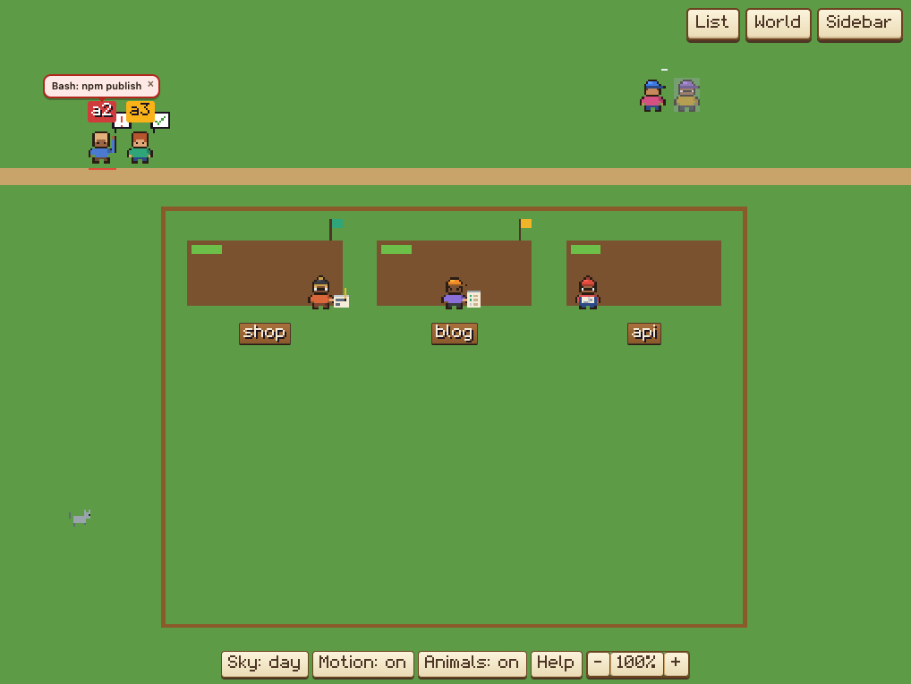
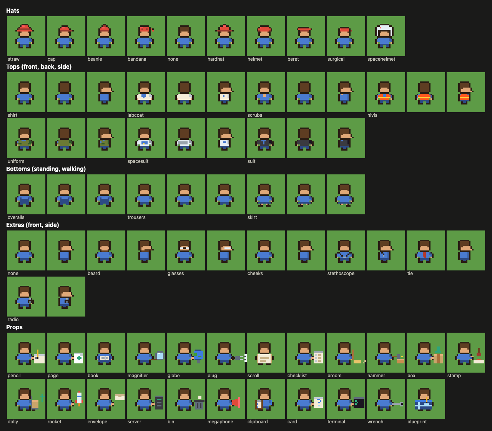

# Worlds

A world is a way to draw what the dashboard knows. The farm is the first one. This page is the guide
to making a world, and the reference for what a world gets from the dashboard and what it can do. To
make one, start at "Making a world": it is the loop, and the sections after it are its steps and the
reference they point to.

## What a world is

Each world runs in a sandboxed frame of its own, loaded from `/world/<key>/`. The frame has no token,
no cookies and no storage, and can't fetch, post or upload anything (see "What a world can't do", and
"The gaps" for what a frame can still do that the page can't fully close). It sees only the **scene**
(below), which the page builds from
each snapshot, and it reaches the page only through the **messages** below. The page checks every
message, and drops anything else.

A world is a folder holding `world.json` and `world.js`, and any files they use (pictures, sounds,
fonts, stylesheets), with `preview.png`, if you like, for the list of worlds. The collector serves
those files from inside the folder only, and only these kinds: `.js`, `.json`, `.css`, `.png`,
`.gif`, `.webp`, `.svg`, `.woff2`, `.mp3`, `.ogg` and `.wav`. The frame's page
(`web/worlds/sdk/frame.html`) loads, in order: `/base.css` (the dashboard's colours), the world
engine's styles (`/world/sdk/engine.css`), the bridge (`/world/sdk/bridge.js`), the brand mark
(`/brand.js`), the pixel kit (`/world/sdk/pixel.js`), the people and props kits (`/world/sdk/people.js`,
`/world/sdk/props.js`), the creature library and the animals kit (`/world/sdk/creatures.js`,
`/world/sdk/animals.js`), the engine (`/world/sdk/engine.js`), then the world's `world.js`. A world
doesn't choose these: the frame always loads all of them. The world draws into `<div id="farm">`,
which fills the frame.

Keys: a built-in world is named by its folder in `web/worlds/` (the farm is `farm`). Names match
`^[a-z0-9][a-z0-9-]{0,39}$`, and `sdk`, `starter`, `test` and `u` are reserved. Your own worlds are
`u/<name>`; see "Where worlds live".

## The worlds that come with Agentville

| World | Key | What it is |
|---|---|---|
| 🌾 **Farm** | `farm` | Built in, and the default: every agent a farmer, every repo a field, with animals of its own. The README's "The farm" says what each thing on it means |
| 🤖 **Robot factory** | `factory` | Built in: a bright workshop where every agent is a robot put together from parts picked by its id, and every repo an assembly bay where a robot is built as the context fills. It shows everything the farm shows, its own way: the 5-hour limit is floor heat (its Season switch is **Heat**: `seasonNames`), a message is a capsule through pneumatic tubes (its own `flight`), and its panel is the farm's (`panelHud`) in its words. A robot dog, a robot vacuum and a cat live there. The README's "The robot factory" says what each thing means; `web/worlds/factory/world.js` is the second full example after the farm |
| 🌱 **Starter** | `starter` | The template `npm run new-world` copies: plain, short, and not in the list of worlds (see "The starter world"). It can still be framed, so the test page and `check-world` run it |




Each new built-in world joins this catalogue, with its own screenshot in `docs/`, and the README's
list of worlds.

## Making a world

If you are Claude Code making a world for someone, follow these steps in order, and show them the
world-shots pictures.

1. `npm run new-world -- <name>` copies the starter world into your worlds folder (`worldsDir` in
   `config.json`, else `~/.agentville/worlds`) as `<name>/`, with the name (`my-bakery` becomes "My
   bakery") written into its `world.json`. The name is lowercase letters, digits and dashes, up to
   40. It refuses a name that is taken, a worlds folder that is a file, and a name that isn't
   allowed, each with one sentence and exit code 1, and leaves nothing half-made. `--worlds <dir>`
   uses another folder, to try things out (give it to `check-world` and `world-shots` too; the
   dashboard and its test page show only your worlds folder). A `config.json` that can't be read
   gives one warning and the default folder, as the collector does. It prints the next steps, whose
   commands name the world `u/<name>` (so a world of yours called `farm` is never the built-in farm)
   and repeat `--worlds <dir>` when you gave it one.
2. Edit the world. In `world.json`, give it its own `icon`, `description` and `nouns` (only its
   `name` is new; the rest are the starter's): see "world.json". Give the engine the same words in
   `world.js`'s `nouns` hook, with `place` ("Hooks"). In `world.js`, start from the
   starter's hooks ("The starter world" says what each part does); "Hooks" says what each hook gets
   and its default, and the kits ("The people kit", "The props kit", "Creatures") draw people, what
   they hold, and animals. The checklist, in "check-world and the checklist", lists what a world
   should show.
3. See it on the test page, `http://localhost:7777/worlds/test?world=u/<name>` (7777 is the
   dashboard's default port; `new-world` prints yours), which plays the tour ("The test page and
   the tour"). The dashboard must be running. The test page doesn't reload when you save: reload
   it.
4. `npm run check-world -- u/<name>` runs the tour headless and lists what it finds ("check-world and
   the checklist"). Fix every line with a cross; read the lines with a dot.
5. `npm run world-shots -- u/<name>` takes a picture of the world at each stop of the tour (it needs
   Chrome), in `.private/shots/u-<name>/` in the Agentville folder. Look at each one.
6. Choose it in the dashboard: **World**, then its name. Saving a file there reloads it on screen
   ("Reloading as you edit"). A world of yours gets the private scene, with numbers for names and no
   words, until you tick **Can see what agents say** for it in the list of worlds ("Privacy mode").

## Where worlds live

- **Built in:** `web/worlds/<name>/` in the install. The farm is first in the list, the other
  built-in worlds follow A to Z. They can't be replaced.
- **Yours:** `~/.agentville/worlds/<name>/`, or the folder `worldsDir` names in `config.json` (a
  leading `~` is your home). The folder name matches the rule above (lowercase letters, digits and
  dashes, up to 40, starting with a letter or digit). Yours are listed after the built-in ones, A to
  Z, and are served under `/world/u/<name>/`. A world of yours named `farm` is `u/farm`: it never
  replaces the farm.

The collector lists every world at `GET /api/worlds` (token only), with the folder it reads yours
from. Files of a world are served from inside its own folder only: `..`, hidden names and links
pointing out of the folder are refused with a plain 404, for yours as for the built-in ones. They
are served without the token, like the farm's, to anything on this Mac that asks for them by path,
so keep nothing secret in a world's folder.

A world's folder may itself be a link (a world you develop elsewhere): it is followed, and its
target becomes the world's folder, and must hold a `world.json` of its own (a folder without one
is listed as "world.json is missing." and serves nothing). A link to your worlds folder, to your
home folder, or to any folder above either (`/`, `/System/Volumes/Data` and so on) is refused
("This folder is a link to a folder that holds other things; link to the world's own folder."),
however the link is spelled: it is judged by which folder it is (device and inode), not by its
name, so capitals and firmlinks don't get around it. A broken link or a link loop is listed ("This
folder is a link to something that isn't there.") without hiding the other worlds. The folder's
name must match exactly: on a disk that ignores capitals, `Space` is not `u/space`.

`worldsDir` is read when the collector starts. A leading `~` is your home folder, a relative one
is under it (one that would land outside it, such as `../x`, is ignored), and an empty one means the
default. A `worldsDir` that is your home folder or above it (or `/`) is ignored too: the default
`~/.agentville/worlds` is used, and the collector's log says why.
A folder that has no name the rule allows is listed with an error and can't run. A world with any
error has no frame.

### Reloading as you edit

The collector watches `web/worlds/` and your worlds folder. When files in a world change, the
dashboard reloads that world's frame once the changes stop (about 0.2 s), as if it had just been
opened: a `start` again, the latest scene, the selection. Zoom and the `view` place come back. A
change in `sdk/` reloads whichever world is showing, and so does your worlds folder appearing. If the
list is open it is refreshed. A world folder that is a link isn't watched, because the watcher
doesn't follow links: reload the page to see an edit to it. Edits to a world that isn't showing
reload nothing. The test page doesn't reload on a save at all: reload it.

## world.json

The farm's:

```json
{
  "name": "Farm",
  "icon": "🌾",
  "description": "Every agent a farmer, every repo a field",
  "api": 1,
  "nouns": { "agent": "farmer", "agents": "farmers", "repo": "field", "repos": "fields", "start": "barn", "diary": "Farm diary" },
  "taken": ["chicken", "dog", "pigeon"]
}
```

| Field | Meaning |
|---|---|
| `name` | The world's name: in the list of worlds, on the view button, and as the frame's title |
| `icon` | One emoji, beside the name in the list and on the view button (`preview.png` in the folder, if there, takes its place in the list) |
| `description` | One line saying what the world shows, in the list |
| `api` | The version of this page the world was written for: `1` |
| `nouns` | What the world calls things: an agent and agents, a repo and repos, where a new session starts (`start`), and its diary (`diary`). The page uses `diary` as the title of the world's diary in its sidebar ("Diary" without one); the others are kept for the page's words to match, and an engine world gives its own to the engine (the `nouns` hook) |
| `taken` | The shapes this world already uses for data, as creature kinds: its animals may not take them (see "Creatures"). The farm's chickens are subagents, its dog is an Explore subagent and its pigeons carry mail, so its fun animals are never a chicken, a dog or a pigeon |

The page reads `world.json` through the same checks as any other file of the world: a link pointing
out of the folder is never followed (it counts as missing).

The rules, as checked (the first that fails is the error the list shows):

- The file is at most 64 KB ("world.json is too large (over 64 KB).").
- `name`: a string of 1 to 40 characters, not blank. A longer one is an error.
- `icon` (optional): a string of at most 8 characters, one emoji. Without one (or an empty one), 🧩.
- `description` (optional): a string of at most 140 characters. A longer one is an error (the list
  still shows the name and description, cut short to 40 and 140 characters).
- `api`: a whole number, 1 or more, and no more than the version this Agentville has (1).
- `nouns` (optional): an object; only `agent`, `agents`, `repo`, `repos`, `start` and `diary` are
  kept, each a string of at most 30 characters. Other keys are dropped.
- `taken` (optional): a list of at most 16 kind names, each lowercase letters, digits and dashes,
  starting with a letter (up to 24 characters).
- Any other field is ignored (the starter's `world.json` has an empty `author`).

What a world can show in the list instead of running:

| Error | Meaning |
|---|---|
| `world.json is missing.` | No `world.json` in the folder, or it is a link out of it (such a folder serves no files) |
| `world.json can't be read: …` | It isn't valid JSON |
| `world.json is not a JSON object.` | It is JSON, but not `{ … }` |
| `world.json needs a "name", up to 40 characters.` | `name` is missing, blank, not a string or too long |
| `world.json: "icon" is one emoji.` | `icon` isn't a string of up to 8 characters |
| `world.json: "description" is up to 140 characters.` | `description` isn't a string of up to 140 characters |
| `world.json needs "api": 1.` | `api` is missing or not a whole number of 1 or more |
| `This world needs a newer Agentville (…)` | `api` is higher than this Agentville knows |
| `world.json: "nouns" are short words.` | `nouns` isn't an object of strings up to 30 characters |
| `world.json: "taken" is a list of up to 16 short kind names (…)` | `taken` isn't a list of up to 16 kind names |
| `world.json is too large (over 64 KB).` | The file is bigger than 64 KB |
| `world.js is missing (or is a link out of the folder).` | No `world.js`, or it points outside the folder |
| `This folder is a link to something that isn't there.` | A broken link or a link loop |
| `This folder is a link to a folder that holds other things; link to the world's own folder.` | The link points at your worlds folder, above it or at your home folder |
| `A world's folder name is lowercase letters, digits and dashes (up to 40).` | The folder's name breaks the rule |

A world with a problem still has its name, icon and description shown if they are fine; it just
doesn't run.

## The scene (version 1)

The page builds the scene from each snapshot (`web/scene.js`) and sends it to the frame. It holds
plain facts only: states, tools, context, deploys, the plan's limits. Each world turns them into its
own pictures (the farm into hats, crops and weather).

```
{ version: 1, generatedAt, private: false,
  plan: { windows: [{ kind, pct, resetsAt, reset }], fiveHour: window|null, weekly: window|null } | null,
  accounts: [{ key, name, plan }],
  chrome: { counts, asking, agents, oldestWaiting, subagentsRunning, ram, cpu, collector, errors },
  subagents: [{ id, label, type, state, parent, startedAt }],
  subagentCounts: { done, overflow },
  mail: [{ from, to, at, text }],
  mcp: [{ server, busy }],
  repos: [{ key, name, branch, onMain, dirty, ahead, behind, deploy, collision, worktree, main, project, projectName, prs }],
  agents: [{ id, name, kind, cwd, state, repo, tool, summary, step, contextPct, hot, ask, askKind, question, reply, said,
             colorIndex, color, cost, mode, kids, tasks, compactions, thinking, turn, effort, model, family, fast, planAsk,
             service, jobs, wakeAt, nap, account }] }
```

Times are milliseconds since 1970, as `Date.now()` gives them.

**The whole scene**

- `version`: `1`, the version this page describes.
- `generatedAt`: when the collector took the snapshot.
- `private`: `false` for the farm and any world you have allowed to see what agents say; `true` for one of
  your worlds that may not (see "Privacy mode": most words and all paths are removed).
- `plan`: the plan's usage limits, from the mod; `null` without a reading. `windows` lists every
  window: `kind` (`five_hour`, `seven_day`, …), `pct` (0–100 used; 0 once it has reset), `resetsAt`
  (when it resets, or `null`) and `reset` (it has reset since it was read). `fiveHour` and `weekly`
  are two of them by name, or `null`. With several Claude accounts it is the first account's.
- `accounts`: your Claude accounts (config folders), the first first, each `{ key, name, plan }`:
  `key` is short and stable (`main` for `~/.claude`, `zeta` for `~/.claude-zeta`), `name` is what you
  call it (`config.json`'s `accounts`, else the key), and `plan` is its limits in `plan`'s shape, or
  `null` without a reading. With one account the list has one. No email or organization is ever in
  it. A world can draw each account's limits: the farm gives each its own silo, the starter a meter.
- `chrome`: what the dashboard's top bar and count cards say, for a world that draws its own panel
  (the farm fills the window, so it does). `counts`: agents per state (`waiting`, `working`,
  `yourTurn`, `idle`, `stale`) and `collisions`. `asking`: agents that asked you something. `agents`:
  how many agents. `oldestWaiting`: since when the longest-waiting agent waits, or `null`.
  `subagentsRunning`: agents with a subagent running. `ram`: `{ usedMb, totalMb }` (the agents' memory
  and the Mac's). `cpu`: `{ used, cores }` (the agents' CPU, in percent of one core, and the Mac's
  cores). `collector`: the tracker's own `{ pid, cpu, rssMb, claudeVersion }`. `errors`: sources that
  are failing, as short lines.
- `subagents`: every subagent: its `id`, `label` (its task), `type` (`Explore`…), `state` (`running`,
  `done`, `failed`…), `parent` (its agent's name) and `startedAt`.
- `subagentCounts`: `done` is how many subagents finished lately (up to 6); `overflow` is how many run
  beyond the four an agent leads.
- `mail`: messages one agent sent another in the last 3 minutes, oldest first: `from` and `to` (agent
  ids), `at` and `text`.
- `mcp`: the MCP servers agents called in the last hour (up to six, by name): `server`, and `busy`,
  the id of the agent calling it now, or `null`.

**Each repo** (`repos`)

- `key`: its folder, which is also its id (in a private scene: a stand-in, `r1`, `r2`…). `name`: the folder's name (private: `repo 1`…).
- `branch`: the branch it is on, or `null`; `onMain`: that branch is `main` or `master`.
- `dirty`: uncommitted files; `ahead` and `behind`: commits against its upstream.
- `deploy`: its last deploy, or `null`. From the collector: `{ state, label, detail, url, source }`,
  with `state` `running`, `ok`, `failed`, `blocked` (a GitHub Actions run that never started, such
  as one stopped for billing: not a failed deploy) or `other` (a run that ended another way), and its
  words. From a bare GitHub Actions run:
  `{ state: 'running' | 'ok' | 'failed' | 'other', label: null, detail: null, url, source: 'actions', run: true }`.
- `collision`: two agents writing in it at once: `'high'` (one of them used git), `'normal'`, or `null`.
- `worktree`: it is a git worktree; `main`: the folder of the repo it belongs to, or `null`.
- `project`: an id for grouping repos that sit side by side in one folder (that folder's path; in a private scene a stand-in, `p1`, `p2`…), or
  `null`; `projectName`: its label.
- `prs`: its pull requests, from `gh`, or `null`: `{ open: [{ number, title, url, draft, branch, checks }], merged: [{ number, title, url, at }] }`,
  with `checks` `ok`, `failed`, `running` or `null`.

**Each agent** (`agents`)

- `id`, `name` (private: `agent 1`…); `kind`: `interactive`, `background`, `codex`…; `cwd`: its folder, or `null`.
- `state`: `waiting` (on you: a question or a permission), `working`, `turn` (its turn ended),
  `idle` or `stale`.
- `repo`: the repo it works in (its newest write, else its newest touch, else the repo holding its
  folder): a repo's `key`, or `null`.
- `tool`: the tool it is calling now, or its last one; `summary`: what that call does, in a few words;
  `step`: the kind of work it is (`edit`, `read`, `search`, `test`, `build`, `commit`, `push`,
  `deploy`, `web`, `mcp`…), or `null`.
- `contextPct`: the share of its context window used, 0–1, on a 1M window once past 200k tokens.
- `hot`: its CPU is over the alert setting (`cpuAlertPct`, 90% by default).
- `ask`: the text of what it asks you, when waiting; `askKind`: `question`, `permission`, `always`
  or `null`; `planAsk`: it is a plan waiting for your approval.
- `question`: a question it ended its turn with, or `null`. `reply`: the first line of its last reply.
  `said`: its last reply as one plain line, up to 160 characters, for a speech bubble.
- `colorIndex` and `color`: its colour (one of eight, by its id, never by its place in the list), as
  the dashboard shows it.
- `cost`: what the session has cost so far in US dollars, or `null`. `mode`: its permission mode
  (`default`, `plan`, `acceptEdits`, `bypassPermissions`…), or `null`.
- `account`: the `key` of the Claude account it runs on (one of `accounts`), or `null` (a Codex session).
- `kids`: its running subagents, up to four: `{ id, dog }`, `dog: true` for an Explore one.
- `tasks`: its task list, `{ done, total, current?, items }`, or `null`. `compactions`: how many times
  its context was compacted.
- `thinking`: it is thinking now (from the mod's working line; without the mod, a guess: working with
  no tool call open). `turn`: while working, `{ startedAt, outTokens?, word?, mode? }` (the working
  line's word and mode), else `null`. `effort`: its effort setting, or `null`.
- `model`: its model's name, or `null`; `family`: `opus`, `sonnet`, `haiku`, `fable` or `null`;
  `fast`: fast mode is on.
- `service`: where a web or connector call goes (`Gmail`, `github.com`…), or `null`.
- `jobs`: background commands running.
- `wakeAt`: when it wakes up by itself, or `null`; `nap`: it is a session that will wake up by
  itself (`/loop`), resting until then.

## Hooks

A world drawn by the engine (`web/worlds/sdk/engine.js`, over the pixel kit in `pixel.js`) gives its
hooks to `Agentville.world(hooks)`, which fills in a default for each one it leaves out and runs the
world through the bridge. The frame has already loaded `bridge.js`, `brand.js`, `pixel.js`, the kits
(`people.js`, `props.js`, `creatures.js`, `animals.js`) and `engine.js` when your `world.js` runs. (A
world that draws everything itself, without the engine, registers with `Agentville.raw` instead: see
"Running a world", in "Messages".)

```js
(() => {
  Agentville.world({ W: 400, slots(agent) { … }, drawChar(agent, body) { … }, bg(fill, season, ext) { … } });
})();
```

Wrap `world.js` in a function like this. The SDK's own top-level names share the frame's scope with
your script, so a top-level name of yours can collide with one of them, in two ways. The SDK's
`function` declarations (such as `makeGrid`, `withDefaults`, `engineScene`, `makePixelView`) are
silently replaced by a top-level `function` of yours with the same name — and the engine then calls
yours (your `engineScene` would take the place of the one that turns the scene into the engine's). Its
`const` and `let` names (`ACTIVE`, `px`, …) can't be declared again: that is a SyntaxError that stops
the world. Inside a function your names are your own, and the SDK's are still there to use.

### The four a world must give

A world without one of them stops with an error that names it.

- `W`: the world's width in world pixels (a number above 0).
- `slots(agent)`: where this agent stands. Either `{ group, cap, at(i) → [x, y], zone }` (room for
  `cap` agents of the same `group`; `at(i)` is the i-th spot; more than that are not drawn, and
  the count over is given to `labels` as `overflow[group]`), or, for agents standing in a field,
  `{ group: 'st:<key>', at(usedOffsets) → [x, y], zone }` (push the offset you took into
  `usedOffsets`; no cap).
- `drawChar(agent, body)`: draws the agent. `body` has `x`, `y`, `walk` (walking now), `face`, `lift`
  and `zone`.
- `bg(fill, season, ext)`: draws the ground. `fill(x, y, w, h, colour)` paints a rectangle; `ext` is
  `{ x0, x1, y0, y1 }`, the area to cover (it grows past the world's edges when the frame has room).
  `season` is the season shown: your `season()`, or the one the Season switch holds ("Seasons",
  below). It is redrawn when the season turns or is switched, the layout changes or the frame is
  resized.

### The optional ones, with their defaults

A hook you give always wins over its default.

| Hook | Arguments | Default |
|---|---|---|
| `corridors` | | `[W / 2]`: the x positions of the paths running down, which agents walk along. A non-empty array of numbers, else the world stops |
| `grid` | | a `makeGrid` result, or the config for one (below); by default 3 beds of 88 × 62 centred on W |
| `fromScene` | `(sceneV1)` | `engineScene` |
| `help` | `()` | the info dialog's HTML: a short key naming your `nouns` |
| `nouns` | | `{ agent, agents, repo, repos, place }`: `agent`, `agents`, `repo`, `repos`, and `place`, `'world'`: the world's name for itself, which the engine uses in its own words ("Loading the …", "How to read the …", "The whole … : click to go there"). The close-up's legend and the engine's help default say `agents` and `agent` too. Give them all, so no word of the farm's is left (the farm's are `farmer`, `farmers`, `field`, `fields` and `farm`) |
| `key` | | `'world'`: a short name for the world. The engine doesn't read it today (the farm gives `'farm'`), so check-world's list of hooks left to their defaults starts with it |
| `SH` | | `16`: a character's height |
| `layout`, `relayout` | `()`, `(ground)` | the grid's current ground; `relayout` keeps the new one and returns it |
| `setScene` | `(scene)` | returns `[]`. May return events `{ id?, at?: [x, y], text, cls?, log?, who?, kind? }`: a pop-up with `text` over the agent `id` (or at `at`), a line in the log if `log` is set (under the agent's name; with no agent, under `who`, else "The market"), and, with a `kind`, a reaction from the animals ("Reactions", in "Creatures"). The engine records `scene.fields` itself, whether or not you give one |
| `spawn` | `()` | `[W / 2, 0]`: where a new agent appears |
| `follow` | `(body, k, T, kid)` | where the k-th subagent stands beside its agent (`T` the clock, `kid` the subagent's scene entry) |
| `flight` | `(a, z, t, T)` | the engine's carrier pigeon, flying an arc from the sender to the receiver: leave `flight` out and that is what is drawn. Give it to draw how a message travels your way. It is called each frame while a message from one agent to another is on its way, 2.4 s (only with motion on: drawn still, there is none, and the diary's line is all), after the agents and their `drawFx` and before `weather`, `top` and the night. `a` and `z` are the sender's and the receiver's bodies, as `drawChar` gets them (`x`, `y`: where it stands, its feet; `walk`, `face`, `zone`, `lift`; `tx`, `ty`: where it is going). `t` is how far along, from 0 when it sets off to 1 when it lands (the seconds since over 2.4); `T` is the clock. Draw it with `px` at a point between them: a paper plane, straight across, is `flight(a, z, t) { px(Math.round(a.x + (z.x - a.x) * t) - 2, Math.round(a.y - 20 + (z.y - a.y) * t), 5, 2, '#ffffff'); }`. The factory's eases `t` and runs a capsule along its pneumatic tubes, from the sender's bay to the receiver's (`flight` in `web/worlds/factory/world.js`). The ✉ that pops over the receiver when it lands is the engine's either way |
| `startText` | `(n)` | "n agents here": the first line of the log |
| `arriveText` | | the string `'arrives'`: the log line when an agent walks in |
| `tag`, `tip` | `(agent)` | the name, cut to 16; the name |
| `onMove` | `(agent, zone, prevZone, pop)` | nothing; `pop(text, cls)` shows a pop-up over the agent |
| `speed` | `(agent)` | `40`: walking speed |
| `zoneText` | `(agent, zone)` | `'moves'`: the log line when an agent changes zone |
| `hud` | `(state)` | the dashboard's buttons: list, world, sidebar, sky, season (in a world with seasons), motion, help, zoom. `state` is `{ still, zoom, saysOn, skyMode, seasonMode, seasonNames, seasons, follow, canFollow, restingHidden, bell, nav, panelOpen, animals }` (`animals`: `true` or `false` for a world with animals, its Animals switch with `data-farm-animals`; `null` for one without. `seasons`: `true` for a world with seasons, whose Season switch is a button with `data-farm-season`, right after the Sky's `data-farm-sky`, saying `seasonMode`: `'live'`, `'spring'`, `'summer'`, `'autumn'` or `'winter'`; the engine moves it on when it is clicked). Your own should keep List and World: an engine world gets no corner control from the page. Or use `panelHud(params, words)`, the farm's panel and buttons in your own words (see the factory, and "`panelHud(params, words)`", below). A panel at the top left with the class `px-stats` (panelHud's, as the farm's, or your own) never covers the world: at 100% the engine fits the world beside it, or below it (and then above the `px-tools` switches) when that leaves it bigger, and fits it again when the panel folds or grows |
| `ground`, `shadows(body)`, `top`, `drawFx(agent, body)` | | nothing: drawn under the agents, under each agent, over everything, and over each agent |
| `season` | `()` | `'summer'`, and no seasons. A world that gives its own has seasons ("Seasons", below): it returns the live season (`'spring'`, `'summer'`, `'autumn'` or `'winter'`), and the HUD gets the Season switch |
| `seasonNames` | | a field, not a function: `{ switch, spring, summer, autumn, winter }`, what the world calls its Season switch and its four levels ("Seasons", below). Any you leave out keep today's word (`'Season'`, `'spring'`…). The default HUD's button reads `Heat: warm` with them; `hud(state)` gets the object as `state.seasonNames`. The setting still saves `live`, `spring`, `summer`, `autumn` or `winter`, and `PXG.season` holds those too |
| `boardTitle` | | a field, not a function: the title of the notice board's dialog, which the `'board'` building opens (below); `'The notice board: what your projects remember'` unless you give one. A string with words in it, trimmed and cut to 80 characters; anything else keeps today's. It is shown as text, never HTML. The factory's is `'The manuals shelf: what your projects remember'` |
| `lights` | `()` | `[]`; each `[x, y, r, colour]` glows at night |
| `items` | `()` | `[]`; each `[y, draw]`, drawn among the agents in order of `y`. Return a fresh array each call: the engine pushes its own into it |
| `movers` | `(posOf)` | `[]`; each `{ key, html, title, x, y }`, an HTML label that moves; `posOf(id)` gives an agent's body |
| `labels` | `(lab, overflow)` | each field's name under its bed. `lab(x, y, html, cls, title)` places HTML at a world position; `overflow` counts the agents over each group's `cap`. Drawn again when the fields, the overflow, `plan` or `accounts` change |
| `fieldAt` | `(x, y)` | `null`: the field under that point, which opens its close-up |
| `buildingAt` | `(x, y)` | `null`: the building under that point (a key, below) |
| `buildingTip` | `(key)` | `''` |
| `dialog` | `(key)` | `null`; or `{ title, html }` |
| `boardSessions` | `()` | `[]`: the agents the notice board is read from |
| `emit` | `(agent, body, dt, addParticle)` | nothing: called each frame per agent |
| `tick` | `(dt, posOf, snap)` | nothing: called each frame, and `snap` is true when the world is drawn still |
| `ambient` | `(dt, addParticle)` | nothing: called each frame |
| `weather` | `(sky)` | nothing: drawn over the sky |
| `animals` | `()` | `[]`: the world's creatures (see "Creatures"): a list, or `{ cast, gags, play }`. With any, the engine draws them and adds an Animals switch |
| `roam` | `()` | `[]`: rectangles `{ x, y, w, h }` where they may walk. Keep them off anything that shows data |
| `avoid` | `()` | `[]`: rectangles inside those that they keep off (a pond, a henhouse) |
| `perches` | `()` | `[]`: `[x, y, lift]` points a climber stands on, `lift` pixels up (a woodpile, a rock). One it can't reach is skipped |
| `spots` | `()` | `{}`: named points gags go to (`{ hammock: [x, y] }`), and `huddle`, where they gather in winter. A spot may be inside an `avoid` rectangle: only a gag goes in |
| `spotFree` | `(name)` | `true`: may a gag use that spot now (the farm's hammock is taken while an agent naps) |

Buildings: `buildingAt` returns a key when the point is on a building. The key `'barn'` calls the
page's ＋ Session (starting a session) and `'board'` opens the notice board, built from
`boardSessions()` and titled by `boardTitle`. Any other key goes to `dialog(key)`, which gives the dialog's title and HTML (or
`null` for none).

### Seasons

A world has seasons when it gives its own `season()` hook; the default (`'summer'`) is none. Yours
returns the live season, `'spring'`, `'summer'`, `'autumn'` or `'winter'`, by a rule of your own (the
farm's follows your plan's 5-hour limit, from the scene's `plan`: the first account's, when you have
several). A world with seasons gets the
**Season switch** in its HUD (the default HUD's, or your own `hud`'s, from `seasons` and
`seasonMode`): live, then spring, summer, autumn and winter held, then live again, saved as the
world's `season` setting. A world without seasons gets no switch, and is always drawn in its own
`season()`.

A world may name the switch and its levels with a `seasonNames` field, so its words fit the place.
The factory's follow the 5-hour limit as floor heat:

```js
seasonNames: { switch: 'Heat', spring: 'cool', summer: 'warm', autumn: 'hot', winter: 'steaming' },
```

The default HUD then shows `Heat: steaming` (and `Heat: live`). A name left out, empty or not a string keeps today's word
(`Season`, `spring`…); names are trimmed and cut to 24 characters, and the farm gives none. Only the words change: the saved setting and
`PXG.season` stay `live`, `spring`, `summer`, `autumn` and `winter`, and an own `hud` gets the names
as `state.seasonNames`.

Draw the season shown, never your own: `bg` gets it as `season`, and `PXG.season` holds it while the
engine ticks and draws (it is set before each frame's `emit`, `tick`, `ambient` and drawing; `null`
before the first). The animals go by it too: a held winter brings the goats' scarves and the icy
pond. Keep your own live season only for what tells the person their real numbers: while a season is
held, the farm's panel shows it with a 📌 and the real 5-hour use, and its tooltip says it is held,
not live.

Seasons for the starter, by the 5-hour limit as on the farm (its `scene`, `W` and `DOOR_Y` are its
own names):

```js
// Inside the starter's function, beside its other names: the live season.
const liveSeason = () => {
  const w = scene.plan?.windows.find(x => x.kind === 'five_hour');
  if (!w) return 'summer'; // no reading yet
  const p = w.reset ? 0 : w.percentUsed;
  return p < 25 ? 'spring' : p < 60 ? 'summer' : p < 85 ? 'autumn' : 'winter';
};
```

Then, among its hooks, `season: liveSeason,`; in `bg`, the grass in the season shown (its first
line):

```js
fill(ext.x0, ext.y0, ext.x1 - ext.x0, ext.y1 - ext.y0, season === 'winter' ? '#e6eef5' : '#5d9b46'); // snow, or grass
```

and at the end of `ground()`, what changes with it each frame:

```js
if (PXG.season === 'winter') px(0, DOOR_Y + 1, W, 1, '#ffffff'); // snow along the path, held or live
```

### Drawing with the pixel kit

The pixel kit (`pixel.js`) is loaded before your `world.js`, and its names are global in the frame:
use them, don't declare them again. Everything is drawn in world pixels; the engine scales the
canvas. What the starter draws with:

| Name | What it is |
|---|---|
| `PXG` | The drawing state: `PXG.ctx` is the canvas being drawn now (a 2D context), `PXG.T` the animation clock, in seconds, `PXG.season` the season to draw (held by the Season switch, or live; "Seasons"): read it rather than your own state when drawing |
| `px(x, y, w, h, colour)` | Paints a rectangle on `PXG.ctx`; the colour is snapped to the kit's palette |
| `blink(hz, n = 2)` | `0`, `1`, … `n - 1`, turning over `hz` times a second: for blinking and simple animation |
| `pixelOrigin(body, SH)` | `[x, y]`: the top left of a 14-wide sprite `SH` high standing at `body` (with the walk's bob) |
| `legFrame(body)` | The people kit's legs for `body`: `'s'` standing, or a walking frame |
| `rpAt(ox, oy)` | `rp(x, y, w, h, colour)`, a painter in a person's pixels from that origin: what props draw with |
| `bubble(rp, x, y, glyph)` | A small speech bubble at `(x, y)` in `rp`'s pixels, holding `'!'`, `'?'`, `'plan'` (a sheet) or, for anything else, a tick |
| `SC` | `1`: one sprite pixel is one world pixel |
| `makeGrid(config)` | The repo grid (below; it is the engine's) |

Others you may want: `ink(colour)` (the palette colour nearest to a colour), `shade(colour, k)` (darker
for `k < 1`, lighter above), `makeSprite(rows, palette)` (a canvas from rows of letters, `.` clear,
and a `{ letter: colour }` palette) and `pxt(text, colour?, shadow?)` (HTML for a text in the pixel
font, for `labels`, `movers` and `dialog`).

### `makeGrid(config)`

The repo grid an engine world lays its fields out on, where a repo keeps its bed while you look, a
project's repos sit together, and a repo that leaves keeps its bed for a day. `config`:

- `cols` (3), `colW`, `rowH`: beds across, and each bed's width and height;
- `cx0`, `top0`: the centre x of the first column and the top of the first row;
- `minRows` (3), `maxRows` (6), `max` (18): how many rows show, and how many beds in all (more show as "+N more");
- `slot(cx, rowTop)` → object: extra fields for each bed (the farm adds `lane`, `x0`, `y0`);
- `fence(rows)` → `{ x0, x1, y0, y1 }`: the fenced ground for that many rows;
- `height(fence)` → the world's height.

It returns `{ layoutFor(fields, beds?, now?), packedLayout(fields, beds, now?), slotAt(i), cols }`.
`layoutFor` returns `{ key, ST, slots, empty, rows, GRID, H, groups, more, beds }`. `ST` is the list of
beds in use, one for each repo: each has the repo's `key`, `i` (its index), `cx` (the bed's centre x), `rowTop` (the top of
its row) and whatever `slot(cx, rowTop)` added (the starter's `lane`, the y its people stand at). That is
what a world draws its repos on and finds a repo's bed by: `L.ST.find(s => s.key === f.field)`, as the
starter's `slots` does, with `L` the layout the `layout` hook gives. `GRID` is the fence, `{ x0, x1, y0, y1 }`.

If a world's `grid` is a config (not a `makeGrid` result), the engine fills in what is missing:
`cols` 3, `colW` 88, `rowH` 62, the first column so the columns are centred on `W`, and a fence half a
column wider on each side (kept inside 0 to `W`).

### `engineScene(scene)`

The engine's scene, from the version 1 scene: `farmers` (the agents, each with `field`, its repo;
`pct`, the context used; `hearts`, left of 4; `shirt`, its colour), `fields` (the repos, with
`lastDeploy`: the repo's `deploy`, or `null` when there is none or it is a bare GitHub Actions run),
`plan.windows` (each with `percentUsed`), `accounts` (each `{ key, name, plan }`, its `plan.windows`
with `percentUsed` too, or `plan: null`), `henhouse`, `carts`, `mail`, `subagents` and `chrome`. Each
farmer keeps its `account`. A
world's `fromScene` can call it and add its own looks (the farm adds each farmer's `look` and each
field's crop, fence, soil, pennant and weather).

The field close-up (a field's files) is still drawn as the farm draws it. Its header, its label and its
messages name your `nouns.repo` ("shop bay", "Loading the bay…", "Could not load the bay…"); its legend
keeps the farm's words, as its pictures are the farm's.

### `panelHud(params, words)`

The farm's panel and buttons, for any world, in its own words: top left, the stats panel (what the
sessions cost, how often they were compacted, the season, the counts and the meters, the "needs you"
button); top right, the dashboard's buttons (List, World, Session, Claude Code, Sidebar, Theme); along
the bottom, the switches and zoom. It returns the HTML, so a world's `hud` can be just a call to it:

```js
// Among your hooks: `scene` is the scene your setScene keeps, `liveSeason` your own season() ("Seasons").
hud: p => panelHud({ ...p, scene, season: liveSeason() }, { place: 'workshop', agent: 'tinker', agents: 'tinkers', compactedWord: 'tidied' }),
```

`params` is the `state` the `hud` hook gets, plus:

- `scene`: the engine's scene (`engineScene`'s, or your `fromScene`'s): its `farmers`, `plan`, `accounts`
  and `chrome`. With two or more `accounts`, the meters show one for each account (its name, cut to 6, in
  capitals, and `account N` for one with no name, N its place from 1, as the private scene names
  accounts; its week used, and its 5 hours beside it) in place of the plan's 5H and WEEK; keep
  `accounts` in a scene of your own, or the panel shows the first account's plan only;
- `season`: the live season (`'spring'` … `'winter'`), shown on the panel by its `seasonNames` word;
- `iconImg(name)`: HTML for one of your icons (`''` for none, the default). The names it is asked
  for: `list`, `world`, `plus`, `gear`, `side`, `day`, `live`, `night`, `follow`, `resting`,
  `bubbles`, `animals`, `pause`, `play`, `bell`, `help`, and whatever `seasonIcon` returns;
- `seasonIcon(level)`: the icon's name for a season (default: the season itself);
- `seasonTip(mode)`: the panel's season tooltip, `mode` being `'live'` or the season held (default: none).

In a world without seasons (`seasons` false) the panel shows no season and there is no Season switch.
With seasons, the Season switch reads `seasonNames.switch` and the level's name, and a held level
shows on the panel with a 📌 and the real 5-hour use.

`words` are the world's words and colours. Any it leaves out are plain ones in its `place`, `agent`
and `agents` (`'world'`, `'agent'`, `'agents'`), with the farm's colours:

| Word | What it is | The farm's |
|---|---|---|
| `place`, `agent`, `agents` | the nouns the plain words below are made from | `farm`, `farmer`, `farmers` |
| `costTip`, `costIcon` | the cost's tooltip, and the class of its icon | "What the sessions on the farm have cost so far (each one's purse; from the mod)", `coin` |
| `compactedWord`, `compactedTip`, `compactedIcon` | the word after the number of compactions ("3 harvested"), its tooltip, its icon's class | `harvested`, "Harvests: each time a session's conversation was compacted", `basket` |
| `textColor`, `shadowColor`, `dimColor`, `labelColor`, `brandColor` | the panel's numbers and their shadow, its dim and label text, the AGENTVILLE mark | `#fff3d6`, `#2a1d14`, `#c9b48a`, `#a9c79a`, `#ffe8a3` |
| `toolColor`, `toolStateColor` | the buttons' names and their states (on, off…) | `#4e3626`, `#8b5a2b` |
| `sideTip` | the Sidebar button's tooltip | "Show the selected farmer's answer box, activity and files beside the farm" |
| `followTip`, `followFirstTip` | Follow's tooltip, with someone picked and with nobody | "Keep the farmer you picked in the middle of the view…", "Pick a farmer first, then Follow keeps it in view" |
| `restingTip`, `bubblesTip`, `animalsTip`, `skyTip`, `seasonSwitchTip`, `motionTip`, `helpTip` | the Resting, Bubbles, Animals, Sky, Season, Motion and Help switches' tooltips | "Idle farmers (under the tree) and stale ones (scarecrows)…", "…what each farmer last said…", "Animals on the farm, just for fun…", "The light: live follows your clock…", "The season: live follows your plan's 5-hour limit…", "Walking and animation on the farm", "How to read the farm" |
| `zoomTip`, `zoomAllTip` | the zoom bar's tooltip, and its % button's | "Zoom the farm inside its frame…", "Show the whole farm" |

A word is text: HTML in it is shown as it is written, never run. A word that isn't a string gets the
plain one. The rest stays the engine's in any world: the count cards, the meters, the dashboard's buttons,
the Bell, and the `data-farm-*` attributes the engine's clicks find the buttons by. Its stylesheet's
`coin` and `basket` are the two icon classes a world can name without CSS of its own.

The factory's `hud` is `p => panelHud({ ...p, scene, season: heat, iconImg, seasonIcon, seasonTip }, FACTORY_WORDS)`:
its words are robots and `built` for compactions, its tooltips say floor heat, its `seasonIcon` gives
a thermometer for each level, and its `seasonTip` explains the heat, live or held. Its `world.js` also
gives the panel a navy glass in place of the farm's green, with a style of its own in its frame (the
frame allows inline styles). A world may recolour the panel the same way, at the top of its function:

```js
const glass = document.createElement('style'); // the panel's colours only: the engine still lays it out and fits the world clear of it
glass.textContent = '.px-stats { background: rgba(28, 42, 72, .92); border-color: #3a3a40; }';
document.head.append(glass);
```

## The people kit



`window.Agentville.people` draws a person in pixels from a body and an outfit. It is loaded in every
frame, after `pixel.js` and before the engine, so a world's `world.js` can use it at once. A person is
14 × 16 pixels, seen from the front, from behind or from the side, standing or in a walking frame.

### The look and the outfit

A **look** is what one person wears: `{ hat, hatColor, band, hair, skin, top, bottom, bottomColor, extra }`.
An **outfit** is what a world offers its people, and `lookFor(agent, outfit)` picks a look from it by the
agent's id, so the same agent always looks the same. Every field of an outfit is optional:

`{ hat?, hatColors?, hair?, skin?, top?, bottom?, bottomColors?, extra? }`

- Each field is one value (no choice) or a list to pick from by the agent's id. A part left out is
  the default (no hat, a shirt, overalls, no extra).
- `hatColors` is a list of `[hat, band]` colour pairs, or `{ <hat name>: pairs, '*': pairs }` to give each
  hat its own pairs (`'*'` is for the rest).
- `bottomColors` is a list of colours; the value `'shirt'` means the agent's own colour (`f.shirt`).
- `hair` and `skin` are lists of colours; without them the kit's own (`HAIR`, `SKIN`) are used.

The starter's people, from `web/worlds/starter/world.js` (its other hooks left out): the outfit at the
top of the wrapper, and the `drawChar` hook that draws each person. `f` is the agent (`f.id` picks its
look, `f.shirt` is its colour) and `b` its body (`b.walk`, `b.face`); `pixelOrigin`, `legFrame`,
`rpAt`, `PXG` and `SC` are the pixel kit's ("Drawing with the pixel kit", in "Hooks"). Change
`OUTFIT` and every person changes.

```js
(() => {
  'use strict';
  const { lookFor, sprite } = window.Agentville.people;
  // Each agent dresses from this outfit, by its id: the same agent always looks the same.
  const OUTFIT = { hat: ['cap', 'beanie', 'none'], top: 'shirt', bottom: 'trousers', extra: ['none', 'glasses'] };
  const looks = new Map();
  const lookOf = f => { if (!looks.has(f.id)) looks.set(f.id, lookFor(f, OUTFIT)); return looks.get(f.id); };

  window.Agentville.world({
    // … W, slots, bg and the starter's other hooks …
    /** A person from the people kit: walking, it faces where it goes; waiting on you, it waves. */
    drawChar(f, b) {
      const [ox, oy] = pixelOrigin(b, 16), view = b.walk ? b.face ?? 'down' : 'down';
      PXG.ctx.drawImage(sprite(lookOf(f), f.shirt, { view, legs: legFrame(b), wave: f.state === 'waiting' }), ox, oy, 14 * SC, 16 * SC);
      if (view === 'down' && f.state !== 'idle') { const rp = rpAt(ox, oy); rp(5, 6, 1, 1, '#2a1d14'); rp(8, 6, 1, 1, '#2a1d14'); } // eyes, shut while idle
    },
  });
})();
```

### What it gives you

- `HATS`, `TOPS`, `BOTTOMS`, `EXTRAS`: the part names the kit draws. `HAIR`, `SKIN`, `BOTTOM_COLORS`:
  colour lists; `HAT_COLORS`: `[hat, band]` pairs.
- `lookFor(agent, outfit)` → a look. `hashOf(id)` and `pick(id, salt, n)` are the hash it picks with.
- `rows(look, view = 'down', legs = 's')` → 16 strings of 14 letters, the picture before it is coloured.
  `view` is `down`, `up`, `right` or `left` (the mirror of `right`); `legs` is `s` standing, `a` or `b` a
  step with each foot, or `p` a pole (a scarecrow's).
- `palette(look, shirt, overrides = null)` → each letter's colour. The shirt, its shade and the hat's
  light are exact; the rest are snapped to the pixel kit's palette. `overrides` is `{ letter: colour }`.
- `sprite(look, shirt, { view, legs, wave, palette })` → a canvas, made once per look, colour and pose.
  `wave` puts one arm up (from the front). `palette` is `overrides` for a special person, such as a
  scarecrow.
- `unknown`: the parts asked for that the kit doesn't have (see "Defaults").
- The eyes are not in the sprite: the world draws them on top (row 6, or 7 when looking down).

### The parts that exist now

"Fixed" colours come from the kit, not the look. "Hat" and "band" are the look's `hatColor` and `band`;
every hat but `none` also has a highlight in a lighter shade of the hat colour.

| Kind | Part | What it looks like | Colours |
| --- | --- | --- | --- |
| hat | `straw` | a wide straw hat with a band | hat, band |
| hat | `cap` | a peaked cap | hat, band (the peak) |
| hat | `beanie` | a knitted hat with a band and a bobble | hat, band (the band and bobble) |
| hat | `bandana` | a tied bandana | hat, band (its dots) |
| hat | `hardhat` | a hard hat with a brim | hat, band (the brim) |
| hat | `helmet` | a rounded helmet over the ears | hat, band (the ear pieces) |
| hat | `beret` | a flat beret with a band | hat, band |
| hat | `surgical` | a surgical cap | hat, band (its tie) |
| hat | `spacehelmet` | a glass bubble round the face, on a collar | fixed (glass; the collar in the outline colour), and one glint in the hat colour |
| hat | `none` | the bare head and hair | hair |
| top | `shirt` | a shirt | the agent's colour |
| top | `labcoat` | a white coat open over the shirt | fixed (cream); the shirt shows at the neck and down the front |
| top | `scrubs` | a V-neck top | the agent's colour |
| top | `hivis` | an orange vest with a yellow stripe over the shirt | fixed (orange, yellow); the shirt shows at the shoulders |
| top | `uniform` | an olive uniform with a shoulder patch | fixed (olive, dark green); the collar and the patch are the agent's colour |
| top | `spacesuit` | a white suit with a chest panel, gloves and a pack on the back | fixed (white, grey gloves and pack); the panel is the agent's colour, with one yellow light |
| top | `suit` | a dark jacket with the shirt down the front | fixed (dark); the shirt is the agent's colour |
| bottom | `overalls` | a bib over the top, and the hips and legs | the bottom colour (the bib too) |
| bottom | `trousers` | trousers | the bottom colour |
| bottom | `skirt` | a skirt, the legs bare | the bottom colour |
| extra | `none` | nothing extra | |
| extra | `beard` | a beard on the face | hair |
| extra | `glasses` | glasses on the face | fixed (glass) |
| extra | `cheeks` | pink cheeks | fixed (pink) |
| extra | `stethoscope` | tubes round the neck down to the chest | fixed (dark tubes, a metal end) |
| extra | `tie` | a tie down the shirt | fixed (red) |
| extra | `radio` | a radio clipped at the chest | fixed (a metal aerial, a slate face) |

There is no apron. For a baker's or cook's whites, the closest tops are `labcoat` (a white coat, worn
with a white `beret` or `surgical` cap in `hatColors`) and the `overalls` bottom, whose bib reads as an
apron over the shirt. A world that wants a real apron draws one over the person in `drawFx`, with
`rpAt(ox, oy)` as props do.

A bottom colour of `'shirt'` in `bottomColors` takes the agent's colour, so `bottomColors: ['shirt']` makes
trousers or a skirt in the same colour as the shirt (scrubs, a suit). An empty `hatColors` list falls back to
the kit's hat colours.

A hospital (a doctor in a white coat or scrubs, a surgical cap, a stethoscope): in the starter, put this
in place of its `OUTFIT`.

```js
const OUTFIT = { hat: ['surgical', 'none'], hatColors: [['#3d7be0', '#2c4a85']], top: ['labcoat', 'scrubs'], bottom: 'trousers', bottomColors: ['shirt'], extra: ['stethoscope', 'glasses', 'none'] };
```

### Defaults

A part the kit lacks (`hat: 'hardhatt'`) is drawn as that part's default (no hat, a shirt, overalls or no
extra), and never throws. The names asked for and not found are collected in `people.unknown`
(`'hat:hardhatt'`), and `check-world` lists them.

### The farm

The farm's farmers are this kit in farm clothes: its `FARMER` outfit (a straw hat, or a dyed cap, beanie
or bandana, or none; overalls over the shirt; a beard, glasses or cheeks), the slate caps of codex
agents, and a scarecrow, which is the same person in sacking colours on a pole.

A world's `drawChar` decides which look it draws. The farm draws a farmer whose hat a goat has
(`b.hatless`, from the animals kit: "Gags and play") with its look's `hat: 'none'`, and leaves out the
model's pin that sits on the hat:

```js
drawChar(f, b) {
  const look = b.hatless ? { ...f.look, hat: 'none' } : f.look; // a goat has its hat
  // …then sprite(look, shirt, { view, legs, wave }) as usual
}
```

## The props kit

`window.Agentville.props` is what a person holds for each kind of step Claude Code takes. It is loaded in
every frame right after the people kit. Every step has a plain prop, and no two props look alike (the
picture at the top of "The people kit" shows them all, in a person's hands). A prop is drawn around a
14 × 16 person: `rp(x, y, w, h, colour)` paints in the person's pixels, the person spans x 1–12 and
y 0–15, and the right hand is at x 11–12, y 11–12. Props that go to the person's left use x below 11.

| Step | Prop | Verb (for the tip) |
|---|---|---|
| `edit` | `pencil` | editing |
| `write` | `page` | writing a new file |
| `read` | `book` | reading |
| `search` | `magnifier` | searching |
| `web` | `globe` | on the web |
| `mcp` | `plug` | using a connector |
| `skill` | `scroll` | following a skill |
| `test` | `checklist` | running the tests |
| `lint` | `broom` | tidying up |
| `build` | `hammer` | building |
| `install` | `box` | installing |
| `commit` | `stamp` | committing |
| `push` | `dolly` | pushing |
| `deploy` | `rocket` | deploying |
| `pull` | `envelope` | pulling |
| `serve` | `server` | keeping a server running |
| `delete` | `bin` | deleting |
| `agent` | `megaphone` | calling helpers |
| `plan` | `clipboard` | planning |
| `ask` | `card` | asking you something |
| `shell` | `terminal` | running a command |
| `other` | `wrench` | working |
| plan mode (`mode: 'plan'`) | `blueprint` | drawing up plans (plan mode) |

`props.STEPS` is this table as `{ step: { prop, verb, spot } }` (`spot` is where the person stands in its
plot: -26 left for looking things up, 26 right for working, 0 the middle), `props.PLAN_MODE` is the
plan-mode row, `props.PROPS` lists the prop names and `props.draw(prop, rp, T, flag)` draws one and
returns `false` when the kit has no such prop.

### Your own steps and props

`props.kit({ steps, props })` makes a world's own set: `steps` changes or adds steps (`planMode` too), and
`props` draws its own props. Everything you leave out is the kit's. It returns `{ steps, actionOf, doing,
draw }`. The starter makes its set with `const props = window.Agentville.props.kit();`. Put this in place
of that line, and its `slots` and `drawFx` use your set: everyone running the tests holds a beaker.

```js
const props = window.Agentville.props.kit({
  steps: { test: { prop: 'beaker', verb: 'testing samples' } },
  props: { beaker: (rp, T) => { rp(13, 8, 4, 6, '#a9dcf7'); rp(13, 8 + Math.floor(T * 2) % 3, 4, 1, '#ffffff'); rp(11, 11, 2, 1, '#e0a878'); } },
});
// What the set answers (each line runs; the comment is its value):
props.actionOf('test');        // { prop: 'beaker', verb: 'testing samples', spot: 0 }
props.actionOf('edit').prop;   // 'pencil': the kit's
props.actionOf(undefined, 'Grep').prop; // 'magnifier': an older snapshot with a tool and no step
props.actionOf('nonsense').prop; // 'wrench'
```

A prop may reach past the person's own 14-pixel width (the beaker above is drawn at x 13–16). A step you
change keeps the kit's `spot` (±26 for edit, write, read, search, web, mcp, lint and delete, 0 for the
rest) unless you give `spot`; a step you add has none, so give it one (the starter's `slots` takes a
missing one as 0, the middle). The starter's `slots` stands people by `props.doing(f).spot`.

`doing(f)` says what an agent's person holds now: its step's action, the blueprint while it is working in
plan mode, and `null` between steps (nothing in its hands). Draw it with `props.draw(action.prop, rp, T,
flag)`. `flag` is passed on to the prop, for your own props to use; the kit's ignore it.

### The farm

The farm draws its own props and keeps them; only its plan-mode `blueprint` is the kit's, which is the
farm's own drawing, so the farm looks the same.

## Creatures

Animals that live in a world just for fun: they wander, graze, nap, sleep at night, say short lines
in their own bubbles, and do what you click. They never stand for data. A world opts in with the
`animals()` hook and says where they may walk with `roam()` and `avoid()`; the engine (with the kit,
`sdk/animals.js`, and the creature library, `sdk/creatures.js`, both loaded in every frame after the
props kit and before the engine) does the rest:

- They wander inside `roam`, never into `avoid` (no part of them: a tall one doesn't reach over
  it), never onto what your `fieldAt` and `buildingAt` report, and never across any of it on the way.
  A creature with a `home` keeps to it (the farm's ducks keep to the pond). With no `roam`, the rest
  aren't shown.
- At night most sleep (the lion, the cat and the mouse wander); with motion off they all doze where
  they are.
- Now and then one says a line from `lines.idle`: at most two bubbles at once, 4 s each, 40 characters
  at most, shown as text (never HTML). A bubble moves out of the way of an agent's bubble or name,
  or waits.
- Clicking one (or its `home`) opens its menu. The nearest agent that isn't waiting on you (or on its
  turn: that is waiting for you too), and isn't already away, walks over and does it; one at work goes
  only if it can be there and back in 5 s. The menu says who, and a colour dot sends another. With no
  one free, or motion off, it happens at once, in place.
- The Animals switch (in the default HUD, or your own `hud` with `animals`) hides them all, and is
  saved as the world's `animals` preference.
- The engine sets `PXG.animals` before `ground()`: true while they are shown, so a world can leave
  out what they replace (the farm's scenery duck). It sets `PXG.taken` too: a `Set` of what they have
  just now (`'bucket'` while the ostrich wears it), so the world doesn't also draw it in its place.
- Now and then (one rest in three) one keeps a habit of its own (`habits`, below). Not at night (bar
  the night owls), not in winter.
- They react to what happens: a world event from `setScene` with a `kind` (below), and `arrive`,
  from the engine, when a new agent walks in.
- In winter (the season shown is `'winter'`: your `season()`'s, or one the Season switch holds) the
  goats wear scarves, the pond freezes (the ducks slide on it), they rest twice as long and huddle at
  `spots().huddle`.
- Now and then (every one to two minutes, one at a time) they get up to something: a gag, a short
  script of steps. An agent idle three minutes or more sometimes plays with one (play, two at most).

A creature in `animals()`:

| Field | Meaning |
|---|---|
| `kind` | One of the library's creatures (below). Never one of your `taken` shapes |
| `count` | How many (1) |
| `looks` | One look per creature, in order (the duck's `drake`, `hen`, `duckling`) |
| `name` | The menu's title (the kind) |
| `home` | `{ x, y, w, h }`: it keeps to this area, and clicking it opens its menu |
| `bank` | `[[x, y], …]`: where an agent stands to do something with one that has a `home` (the nearest is used); else beside it |
| `actions` | Its menu, 2 to 4: `{ label, fx?, pose?, line?, run?, gather?, steal?, ms? }`. `fx` is `'hearts'`, `'crumbs'` or `'dust'`; `pose` what it does meanwhile (`happy` by default); `line` a key of `lines` it says; `run` makes it run off; `gather` brings every one of its kind to it (feeding the ducks); `steal`, with `gather`, sends its last `duckling` look first, fast, to say `lines.bread`; `ms` how long (2500) |
| `lines` | `{ idle: […], <key>: […] }`: what it says, now and then (`idle`), after an action (`line`), in a gag (`say`) and when it reacts (the event's kind). 40 characters at most each |
| `habits` | What it does now and then, of: `climb` (onto a `perch`), `circles`, `hide` (the ostrich's head in the ground; it hides from a failed deploy too), `yawn`, `stretch`, `roll` (onto its back), `chaseTail`, `pounce`, `fetch` (runs off and back), `laps` |
| `reacts` | `{ <event kind>: what }`, over the defaults: `'scatter'`, `'hop'`, `'gather'`, `'hide'` or `'run'` (to where it happened); `null` for nothing |

The library's creatures, each drawn on its feet, facing either way: `cow`, `goat`, `sheepdog` (with a
red bandana), `ostrich`, `lion`, `tiger`, `duck` (looks `drake`, `hen`, `duckling`), `cat`, `dog`,
`pigeon`, `mouse`, `fish`, `robodog` (a chrome robot terrier, its tail an antenna with a blinking red
tip; asleep, a green standby light) and `vacuum` (a round robot vacuum with a blue ring light, its
brush turning as it goes). Their poses: `stand`, `walk`, `run`, `eat`, `sleep`, `happy`, `yawn`,
`startled`, `stretch`, `roll`; the duck's `swim`, `dabble` and `slide` (on ice); the ostrich's `hide`.
What they can wear (the kit puts it on): a goat's scarf and a hat (a farmer's, in a gag), the
ostrich's bucket.

The starter's cat, in its hooks (`web/worlds/starter/world.js`). `roam` is the grass below its path,
down to the fence's foot, and `avoid` the fence with its plots, so the cat walks beside the fence and
never at the door or on the bench (both above the path). `W`, `DOOR_Y` (the path's line) and `L` (the
grid's current layout; `L.GRID` is the fence) are the starter's own.

```js
animals: () => [{ kind: 'cat', name: 'Cat', actions: [{ label: 'Pet', fx: 'hearts', line: 'petted' }, { label: 'Feed', fx: 'crumbs', pose: 'eat', line: 'fed' }], lines: { idle: ['mrrp.'], petted: ['purr ♥'], fed: ['MEOW'] } }],
roam: () => [{ x: 8, y: DOOR_Y + 22, w: W - 16, h: L.GRID.y1 - DOOR_Y - 22 }],
avoid: () => [{ x: L.GRID.x0 - 4, y: L.GRID.y0 - 4, w: L.GRID.x1 - L.GRID.x0 + 8, h: L.GRID.y1 - L.GRID.y0 + 8 }],
```

### Reactions

Return events from `setScene` with a `kind` and the kit reacts where it happened (`at`, or beside the
event's agent). An event with an empty `text` pops nothing: it is for the animals only.

| Kind | By default | The farm sends it |
|---|---|---|
| `deployFailed` | They scatter (the ostrich hides) | A field's weather turns to rain |
| `deployOk` | They hop | A field's weather turns to a rainbow |
| `harvest` | Up to four gather there | An agent's conversation is compacted |
| `merged` | Nothing (the farm's sheepdog runs to the stall) | A pull request is merged |
| `arrive` | Nothing (the farm's sheepdog runs to meet it) | From the engine: a new agent walks in |

Each kind at most once in 30 s. Those near it react (within 120 px, or the three nearest), and the
first says `lines[<kind>]` if it has one.

The starter sends none. For its cat to react when a plot's deploy fails, put this in place of its
`setScene`: an event, for the animals only, when a deploy it has seen turns to failed, beside an agent
working in that plot (`scene` is the starter's last scene, `{ fields: [], farmers: [] }` at first).

```js
setScene(next) {
  const was = new Map(scene.fields.map(fl => [fl.key, fl.lastDeploy?.state]));
  const events = next.fields
    .filter(fl => fl.lastDeploy?.state === 'failed' && was.has(fl.key) && was.get(fl.key) !== 'failed')
    .map(fl => ({ kind: 'deployFailed', id: next.farmers.find(f => f.field === fl.key)?.id, text: '' }));
  scene = next;
  return events;
},
```

### Gags and play

`animals()` may return `{ cast, gags, play }`: the creatures, then short scripts they play out.

```
{ id, needs: { <kind>: n, farmer?: 'idle' | 'busy', chicken?: true, spot?: '<name>' }, lines?: { <key>: […] }, steps: [ … ] }
```

`needs` says who it takes: creatures of a kind (awake, not busy with something else), an agent
(`farmer`), a subagent's chicken within 40 px of the first creature, a free spot. A gag starts only
when all are there. Its roles are the kinds it needs (the first of each picked), `'farmer'` (the agent
nearest it) and `'chicken'`. The steps run one at a time:

| Step | What it does |
|---|---|
| `{ go: role, to, run?, ms? }` | Walks there (runs with `run`): `to` is a role (beside it), `'spot:<name>'`, `'away'` (somewhere far) or `'back'` (where it started). Done on arrival, or after `ms` (as long as the walk takes by default). A creature that can't get within 24 px of a role ends the gag; the way into a spot inside `avoid` is checked up to its edge |
| `{ chase: 'farmer', after: role, ms }` | The agent follows the role for `ms` |
| `{ say: role, line }` | The role says `lines[line]` (its own, or the gag's) |
| `{ pose: role, is, ms }` | A pose for `ms` |
| `{ wear: role, what: 'hat' \| 'bucket', on }` | A hat is the agent's own (the agent is drawn `hatless` meanwhile); the bucket is in `PXG.taken` |
| `{ wait: ms }` | A pause |
| `{ fx: 'hearts' \| 'crumbs' \| 'dust', at: role }` | An effect |
| `{ stay: role, is?, ms, while: 'spot:<name>' }` | Stays (asleep by default) while `spotFree(name)` says the spot is free |

The rules the engine keeps for the agents a gag borrows:

- Only idle agents walk: never one waiting on you or on its turn, and never one napping (it wakes by
  itself). One that starts waiting, or gets work, ends the gag at once, and everything is put back
  (the hat on its head, the bucket by the trough, the agent let go).
- Your click comes first: an agent you send to an animal from its menu leaves the gag it was in.
- A busy agent (`farmer: 'busy'`) is never moved: the creature comes to it, and its hat is off 3 s at
  most. A gag that would take longer, or move it, is dropped.
- Motion off, the animals hidden or the page reloaded: every gag ends where it is. The yard changing
  (`roam`, `avoid` or a spot moving) ends a gag it no longer fits, and puts its creatures back inside.

`play` is the same shape, for an agent idle three minutes or more (checked every 45 s, two at most):
the agent walks to a creature and plays (a stick for the dog, a goat to pet). Work, or you, call it
back.

A gag written wrong (no `needs`, `steps` that aren't a list of steps, a step it doesn't know, a role
it wasn't given, a chase by anyone but the farmer) is dropped when the world is read, and one going to
a spot your `spots()` doesn't have is dropped the first time it runs. Either way there is one warning
in the console, "Animals: the gag <id> was dropped: <why>", and the world goes on.

A body the kit has borrowed carries flags for your `drawChar`: `b.hatless` while a creature has its
hat (the farm draws that farmer with `hat: 'none'`, and leaves out the pin on its hat).

The same cat with habits, a reaction and a gag (it jumps at nothing, then says so), as hooks for a
world 200 wide, with fixed rectangles to walk in. In the starter, take only its `animals`: the
starter's own `roam` and `avoid` fit its ground. Its `deployFailed` line is said when the world sends
a `deployFailed` event ("Reactions", above).

```js
animals: () => ({
  cast: [{ kind: 'cat', name: 'Cat', habits: ['yawn', 'pounce', 'chaseTail'], actions: [{ label: 'Pet', fx: 'hearts', line: 'petted' }, { label: 'Feed', fx: 'crumbs', pose: 'eat', line: 'fed' }],
    lines: { idle: ['mrrp.'], petted: ['purr ♥'], fed: ['MEOW'], deployFailed: ['not me'] } }],
  gags: [{ id: 'pounce', needs: { cat: 1 }, steps: [{ pose: 'cat', is: 'startled', ms: 600 }, { say: 'cat', line: 'idle' }] }],
  play: [],
}),
roam: () => [{ x: 4, y: 60, w: 90, h: 40 }],
avoid: () => [],
```

The rules for your creatures: none in a `taken` shape; lines of 40 characters at most (a gag's own
too); `roam` areas, `perches` and `spots` clear of anything that shows data (the farm keeps them out
of its fields, off the hay, crates and mailbox, and off the carts' rank). `npm run check-world`
checks a world's creatures (its `cast`) against these and the table above, and its gags and play
the way the kit reads them: what the kit would drop is a cross (with the kit's own reason), so you see
it there before the browser's console (the checklist's "Creatures" row, in "check-world and the
checklist"). It runs the world's own code, so a world can make its own checks pass: it helps you write
a world, it doesn't vouch for one. Keeping `roam`, `perches` and `spots` clear of data is yours to see
on the test page.

### The helper's lines

With ✨ Helper's **Animal lines** ticked (off by default), Haiku writes fresh lines for the animals on
screen, from the dashboard's facts (names, states, what just happened), and the page sends them to the
world as `chatter` ("Messages"). The kit says them first, each once:

- for `idle` (now and then) and for the five reactions (`deployFailed`, `deployOk`, `harvest`,
  `merged`, `arrive`), as `lines` keys of the same names;
- never for actions you click, gags or play: those keep your fixed lines.

A creature needs no fixed line for a situation to get a fresh one, but give it fixed lines for each:
they are what it says with the helper off, and between batches. The engine tells the page the world's
animals (`cast`) when it starts; a world does nothing for any of this. A world of yours that can't see
what agents say gets only lines with no names in them.

## The starter world

`web/worlds/starter/` is a plain world with everything a world needs, short enough to read at once
(about 100 lines). It shows:

- plots: the engine's repo grid, three across inside a fence, one bed for each repo;
- the door: agents waiting on you, or on their turn, stand at it with a bubble (a waiting one has a
  red ring at its feet);
- the bench: everyone else sits there; idle ones sleep;
- people from the people kit (`lookFor` from the agent's id, `sprite` with the walking legs and the wave);
- every step's prop from the props kit (`props.kit()`, `doing(f)`, `draw`);
- the context filling each plot with green, and the last deploy as a flag on it (green ok, red failed,
  blinking amber running, grey for any other state);
- with two or more Claude accounts, a meter for each in the top left: its week used (green, amber from
  70%, red from 90%), from `scene.accounts`;
- a cat from the creature library (`animals()`, `roam()`, `avoid()`; see "Creatures"), just for fun: it
  yawns, chases its tail and pounces now and then (`habits`), and once in a while jumps at nothing (a
  gag, `pounce`: "Gags and play").

At the tour's `everyone` stop (`npm run world-shots -- starter --stop everyone`, cut to the world's
frame), two people wait at the door (one on a permission, one on its turn), three work in their
plots with their props, two sit on the bench (one asleep, one stale and greyed out), the `shop`
and `blog` plots fly their last deploy's flag (ok, running), and the cat is out on the grass:


The starter you edit is the copy `new-world` made, `<worlds folder>/<name>/world.js`; the changes a
different world needs are mostly in its outfit, its `props.kit()`, `bg` (the ground and what stands for a
repo, drawn at `L.ST`'s `cx` and `rowTop`: "`makeGrid(config)`") and `ground` (what changes while it runs,
such as a repo's last deploy from `scene.fields[].lastDeploy.state` and its context from the `pct` of the
`scene.farmers` whose `field` is its `key`: "`engineScene(scene)`").

Its `world.js` reads top to bottom: its sizes (`W`, where the door and the bench are), the kits
(`lookFor` and `sprite`, the props set), the outfit, the grid (`makeGrid`) and the deploy colours; then
the hooks: its width, grid, paths (`corridors`) and `nouns`, the grid's layout (`layout`,
`relayout`), the scene kept (`setScene`), where new people appear (`spawn`), the cat, where each agent
stands (`slots`), the ground drawn once (`bg`) and every frame (`ground`), each person (`drawChar`),
and what is over each person (`drawFx`). The examples in this guide say what to put in place of which
part.

It leaves out a compaction, subagents, the limits, a collision and a merged pull request (see the
checklist in "check-world and the checklist"): `npm run check-world -- starter` passes with a dot for
each.

It is the template `npm run new-world -- <name>` copies, and it isn't in the list of worlds. It can
still be framed (`/world/starter/`), which is how the test page runs it. Its `world.json` gives the
nouns `person`, `people`, `plot` and `plots`, and its hook says `place: 'world'`.

## The test page and the tour

The test page shows any world playing the **tour**: made-up snapshots, one stop for each thing a
world may have to show. Open it with the dashboard running:

```
http://localhost:7777/worlds/test?world=<key>&stop=<name>
```

- `world`: the world's key. `farm`, `factory`, `starter`, or `u/<folder>` for one of yours (the name of its
  folder in your worlds folder). With no `world`, or one that isn't a key, the page says how to name one.
- `stop`: one stop of the tour, by name (the table below). With no `stop`, the page plays the tour:
  each stop for 4 seconds once the world has started (5.5 for a stop with two snapshots), then the
  next, round and round. A name that isn't a stop shows the first, `everyone`, and the address
  changes to it.

The page shows the world in its frame, as the dashboard does; the stop picker (**◀**, the list of
stops, **▶**); **Play the tour**; what the world asked the page to do (picks, files to open, `nav`,
the bell, motion…), listed and not done, but for two: a GitHub link (`openLink`) opens in a new tab,
as on the dashboard, and motion is applied as well as listed; and the world's diary. Picking a stop
gives it its own address, so a stop can be linked to or screenshotted.

It holds **no token and no real data**: nothing on it comes from your sessions, and its content
policy lets it fetch nothing (`connect-src 'none'`). Every snapshot is made up
(`web/worlds/test/tour.js`, with names like `a1` and paths like `/Users/you/code/shop`) and
goes through `toScene` like a real one, so the world gets a scene exactly as on the dashboard. A
world's **requests** (`agentFiles`, `repoTouched`) get made-up answers in the collector's shapes. The
world's **settings** are kept in memory, starting fresh at each stop with the stop's sky (`sky` is
`day` or `night`) and the season live; `prefs.set` works as usual, but nothing is written to the browser. The page shares
the dashboard's origin (the same address and port), so it never reads or writes the dashboard's own storage in this browser:
the world you chose, each world's saved settings, and the **Can see what agents say** switches are
left as they were.

**Privacy mode is the stop's to say.** At the `private` stop every world, built-in or yours, gets
the private scene (and its requests are refused, as on the dashboard); at every other stop every
world gets the whole scene, a world of yours too, since nothing in it is real. The switch in the list
of worlds plays no part here.

**When a world breaks**, the page shows what the dashboard shows: the error strip over a world that
reported an error after it started, and the panel in place of a world that didn't start in 5 seconds
(with its first error, file and line), or that tried to leave the page. A world that isn't there
(`?world=u/nope`) gets the panel too, never a blank page. On this page the panel's **Back to the
farm** opens the farm's test page at the same stop; **Try again** loads the world again; there is no
list of worlds here, so **Show the list** does nothing.

**For a screenshot.** Once a stop's last snapshot has been shown for a second, the page sets
`document.body.dataset.shown` to the stop's name (a stop with two snapshots shows the second 1.5
seconds after the world starts). Wait for it, then take the picture. With Playwright (Claude Code's
`playwright` tools, or a script):

```js
await page.goto('http://localhost:7777/worlds/test?world=u/my-world&stop=deploy-failed');
await page.waitForFunction(() => document.body.dataset.shown === 'deploy-failed');
await page.screenshot({ path: 'deploy-failed.png' });
```

The page doesn't reload the world when you save its files (it has no line to the collector): reload
the page. The world moves (motion is on), so two pictures of the same stop may differ by a step.

**A picture of every stop at once.** `npm run world-shots -- <world>` does that loop for you (it
needs Chrome; `CHROME` sets its path):

```
npm run world-shots -- <world> [--stop <name>] [--dir <folder>] [--worlds <dir>]
```

`<world>` is `farm`, `factory`, `starter`, `u/<folder>` or just `<folder>` (one of yours; if yours has a built-in
world's name, the built-in is used and a line says so: `u/<folder>` reaches yours). It starts a server
of its own on made-up data (your real sessions and your `config.json` token are not used), opens
each stop of the tour in headless Chrome at 1280 by 820, waits for `document.body.dataset.shown`,
and saves `<stop>.png`. `--stop` takes one stop, `--dir` says where the pictures go (the default is
`.private/shots/<world>/` in the Agentville folder, with `u-my-bakery` for `u/my-bakery`, which git
ignores), and `--worlds` looks for your world in that folder instead of your worlds folder. The clock
and the random numbers are frozen and animations held at their start, so the same world gives the
same pictures run after run, which makes them good to compare. A line starting with a tick is a stop
that showed (with the error strip's text, if the world raised an error after it started). A line
starting with a cross names a stop that didn't show in 15 seconds, with the text of the panel that
took its place (or "never showed"); the run then exits with 1. An unknown world prints `No world
u/<name> in <folder>.` and exits with 1.

The stops, in the order the tour plays them:

| Stop | What it shows |
|---|---|
| `everyone` | A busy morning: every state at once |
| `one` | One agent |
| `sixteen` | Sixteen agents |
| `nobody` | No agents at all |
| `working` | Working: editing a file |
| `waiting` | Waiting on you: a permission |
| `question` | Waiting on you: a question |
| `plan-ask` | Waiting on you: a plan to approve |
| `turn` | Your turn: it finished |
| `idle` | Idle |
| `stale` | Stale: untouched for days |
| `nap` | Napping: it wakes up by itself |
| `thinking` | Thinking between steps |
| `steps` | Every step, and plan mode |
| `context-low` | A repo with little context used |
| `context-high` | A repo nearly full of context |
| `compaction` | A compaction: the context starts again (two snapshots: full, then emptied) |
| `compacted-plain` | After a compaction, without seeing it happen |
| `deploy-ok` | Deploy: ok |
| `deploy-failed` | Deploy: failed |
| `deploy-running` | Deploy: running |
| `deploy-skipped` | Deploy: skipped (Actions didn't run). Its deploy is what the collector sends for a run GitHub never started: `state: 'blocked'`, labelled "⏸ Actions didn't run". A deploy can be `other` too, so draw every state you don't name one way, as the starter's grey flag does |
| `two-working` | Two agents in one repo |
| `collision` | A collision: two agents writing one repo |
| `pigeon` | A message from one agent to another |
| `merged` | A pull request merged (two snapshots: open, then merged) |
| `mcp` | An MCP call: a connector cart |
| `subagents` | Subagents running and done |
| `limits-low` | The 5-hour and weekly limits: barely used |
| `limits-high` | The 5-hour and weekly limits: nearly used up |
| `accounts` | Two Claude accounts: one fresh, one nearly used up (`work` and `home`) |
| `day` | By day |
| `night` | By night (the stop's sky is `night`) |
| `private` | Privacy mode: no words, paths or names |

The tour is a classic script that sets `window.AgentvilleTour`: `stops` (each `{ name, title, sky,
private, frames }`, `frames` being one or two snapshots in the collector's shape), `stop(name)`,
`answer(act)` (the made-up answers), `checks` (pairs of stops that differ in one thing, such as
`deploy-ok` and `deploy-failed`: the checklist in "check-world and the checklist", which
`check-world` compares) and `NOW` (the fixed time the snapshots are set at, 9 October 2026, 09:00
UTC).

## check-world and the checklist

```
npm run check-world -- <world> [--worlds <dir>]
```

`<world>` is `farm`, `factory`, `starter`, `u/<folder>` or just `<folder>` (one of yours; as for `world-shots`, a
built-in world's name wins, with a line saying so); `--worlds` looks for
it in that folder instead of your worlds folder. It needs no browser, server or token: it reads the
world's `world.js` and `world.json`, the SDK and the tour (and `config.json`, only for where your
worlds are).

**Contained, not sealed.** check-world runs a world's code on your Mac, outside the dashboard's
sandboxed frame, so it runs it contained: in a Node of its own that can read only the SDK and the
world's `world.js` and `world.json` (no other file of the world's), can't write or start programs, and
is given none of your environment, nor your terminal: what it prints, the world's words among it (an
exception's message, a creature's line, a part's name), is printed without control characters, as
`world-shots` prints a world's. A `world.js` or `world.json` that is a link out of the world's
folder is refused before anything runs ("world.js is a link to a file outside the world's folder"); a
link to a file inside it is fine. It can still reach the network, so check only worlds you'd trust;
look at any other world on the test page, in its frame. The command says so in a line of its own. It
needs a Node that can contain it (22.13 or later, or 23.5 or later); with an older one it says so and
checks nothing.

It plays **the same tour as the test page** ("The test page and the tour"), headless: each stop in a
fresh `node:vm` holding `scene.js` and the frame's scripts in the frame's order, a stand-in page,
and canvases that record what is drawn. Each of the stop's snapshots goes through `toScene` (and
`privateScene` at the `private` stop), the stop's sky is the world's `sky` setting, and the world
draws 8 frames after each of its snapshots (8 more when it has only one), then one last frame, whose
drawing is what two stops are compared by. The clock and the random numbers are fixed, and a request
(`agentFiles`, `repoTouched`) never gets an answer here.

It reports, a line each:

- **✗ An exception**, with its stop, and the file and line: the line of `world.js` it came from
  (`world.js:44`), even when the SDK threw it for something the world handed it; the SDK's own file
  only when no line of `world.js` led there. A promise the world left failing counts too (once a
  stop), as do a `world.js` that doesn't parse (its line) and one that never registers.
- **✗ A hook that doesn't return** within 2 seconds (a loop, or promise callbacks that never end),
  with what the world was doing: starting, taking a scene or drawing a frame. It is cut off and the
  tour goes on; after three such stops the rest is skipped. check-world never hangs.
- **✗ world.json's problem**, the one the list of worlds would show.
- **✗ A creature, or a gag or play,** that breaks the animals kit's rules (the checklist's last row), a
  line each.
- **· Hooks left to their defaults**: fine when you meant it.
- **· Checklist items drawn the same** in their two stops ("deploy failed" draws the same as "deploy
  ok"). This is **a pointer, not a verdict**: it compares only what is drawn on the canvas in the last
  frame, so what a world shows in HTML (tags, bubbles, its own HUD or panel) isn't seen, and a world
  that shows a thing only as it happens may look the same just after.
- **· Outfit parts the people kit doesn't have** (`hat:hardhatt`): drawn as the default part.
- **· "no roam(): its creatures aren't shown"**: `animals()` without `roam()`, so only creatures with a
  `home` appear.
- **· A creature's fx, pose or look the kit doesn't have**: drawn its own way (no fx, standing, the
  kind's first look), so a pointer, never a cross.

It exits with 1 when there is any line with a cross, else 0. A world copied from the starter with three
mistakes put in (the door's line in `slots` throws, the cat has a line of 41 characters, and a hat is
spelt `hardhatt`), its path shortened and some lines left out (`…`):

```
check-world: u/my-bakery (/Users/you/.agentville/worlds/my-bakery)
  · contained: it can read only the SDK and this world's world.js and world.json, and can't write or start programs (it can still reach the network)
  ✗ 34 stops of the tour, a few frames each: 9 problems
  ✗ everyone: Error: no door here (world.js:44)
  ✗ waiting: Error: no door here (world.js:44)
  …
  ✗ creatures: cat: lines.idle has a line of 41 characters (40 at most): "I knocked your coffee off the desk. Sorry"
  · hooks left to their defaults: key, SH, fromScene, follow, startText, arriveText, tag, tip, …
  · may draw the same (a pointer, not a verdict): a compaction: "compaction" draws the same as "compacted-plain"
  …
  · outfit parts the people kit doesn't have (drawn as the default): hat:hardhatt
```

The starter, the farm and the factory pass with no cross. The farm and the factory draw no item the
same; their only dots are hooks left to their defaults (the farm's `seasonNames` and `boardTitle`, the
factory's `tag` and `shadows`). The starter's dots are explained below the checklist.

### The checklist

What a world should show, each item as two stops of the tour that differ only in it (the tour's
`checks`). check-world points out the items a world draws the same; the test page and world-shots
show you each stop.

| Item | The two stops | What the farm draws | What the factory draws | The starter |
|---|---|---|---|---|
| waiting on you | `working`, `waiting` | the farmer on the porch, waving a red **!** | the robot queued at your desk, waving a red **!**, its beacon blinking red | at the door, a **!** bubble and a red ring |
| a question for you | `working`, `question` | on the porch, waving a red **!** (its bubble asks the question) | at your desk, waving a red **!** (its bubble asks the question) | at the door, a **!** bubble and a red ring, as for waiting |
| your turn | `working`, `turn` | on the porch with a basket | at your desk with a crate of finished parts, a tick (a **?** for a question) | at the door, a tick bubble (a **?** when it ended on a question) |
| a repo filling with context | `context-low`, `context-high` | the crops grow, from seeds to ripe | the robot on the bay's bench is built: frame, wiring, plating, head, its eyes lit | the plot fills with green |
| a compaction | `compacted-plain`, `compaction` | **Harvest!**: the field starts again from seed | **Built!**: the finished robot rolls off on the conveyor, a new frame goes on | left out |
| deploy failed | `deploy-ok`, `deploy-failed` | rain over the field, for the rainbow | the stack light red, with sparks, for the green one | a red flag, for the green one |
| deploying | `deploy-ok`, `deploy-running` | a windmill | the stack light amber, gears turning | a blinking amber flag |
| deploy skipped | `deploy-ok`, `deploy-skipped` | no weather | a grey pause light | a grey flag |
| subagents | `working`, `subagents` | chickens, and a dog for an Explore one | mini drones by the robot, a scanner drone for an Explore one | left out |
| the limits | `limits-low`, `limits-high` | winter (the live season), and the silo's grain | the floor steaming (thermometer, vents), and the power-cell bank's cells | left out |
| several accounts | `working`, `accounts` | a silo for each account, its name on the tag | a power-cell bank for each account, its name on the tag | a meter for each, top left |
| an MCP call | `working`, `mcp` | its cart drives to the farmer | its AGV drives to the robot | the step's prop (props kit) |
| messages between agents | `two-working`, `pigeon` | a pigeon | a capsule through the pneumatic tubes (its own `flight`) | a pigeon (the engine's: it gives no `flight`) |
| a collision | `two-working`, `collision` | rope with orange flags round the field | hazard tape round the bay, pulsing | left out |
| a merged pull request | `working`, `merged` | **Sold!** at the market stall | **Shipped!**: a crate leaves the loading dock | left out |
| idle | `working`, `idle` | under the shade tree | on a charging pad, eyes shut, a charging bolt | on the bench, eyes shut, a zzz |
| stale | `idle`, `stale` | a scarecrow | powered down and grey on the storage shelf | greyed out |
| night | `day`, `night` | lit windows, lanterns and fireflies | desk lamp, screens, stack lights and welding sparks glow | the engine's night |
| **Creatures (optional)** | none: check-world reads `animals()` once | thirteen animals, six gags and three plays, all within the rules | a robot dog, a robot vacuum and a cat, a gag and two plays, within the rules | one cat and its gag, within the rules |

A world with seasons (its own `season()`: "Seasons", in "Hooks") should also follow the Season
switch, which the tour leaves live. On the test page, click it through spring, summer, autumn and
winter: everything seasonal should change with it (draw from `bg`'s `season` and `PXG.season`, never
your own state), and whatever shows the person's real limit should still show it.

The creature rules (see "Creatures"). A cross for each one broken:

- `kind` is one of the library's creatures, and not in `world.json`'s `taken`;
- `count`, if given, is a whole number from 1 to 12;
- `actions` number 2 to 4, each with a `label`, and its `line` (if given) a key of `lines`;
- every line in `lines` is 40 characters or fewer;
- `home` is `{ x, y, w, h }` in numbers, and `bank` a list of `[x, y]`.

A dot for each of these (a pointer, never a cross):

- an action's `fx` is `hearts`, `crumbs` or `dust` (another draws nothing);
- its `pose` is one the creature has: `stand`, `walk`, `run`, `eat`, `sleep`, `happy`, `yawn`,
  `startled`, `stretch`, `roll`, the duck's `swim`, `dabble` and `slide`, the ostrich's `hide`
  (another: it stands);
- `looks` (or `look`), if given, are the kind's own: the duck's `drake`, `hen`, `duckling` (another
  is drawn as the first);
- with no `roam()`, only creatures with a `home` are shown.

When `animals()` returns `{ cast, gags, play }`, the rules above are for its `cast`, and these for its
gags and play ("Gags and play", in "Creatures"). A cross for each that the kit would drop:

- each has an `id` (a string, one per gag), `needs` (an object, its `farmer` `idle` or `busy`) and
  `steps` (a list of step objects);
- every step is one the kit knows (`go`, `chase`, `say`, `pose`, `wear`, `wait`, `fx`, `stay`), and
  every role it names is one it needs (a kind, `farmer`, `chicken`); only the farmer chases; what is
  worn is `hat` or `bucket`;
- a busy farmer is never moved, and its hat is off 3 s at most;
- every spot it uses (`needs.spot`, `spot:<name>`) is in the world's `spots()`;
- its own `lines` are 40 characters or fewer.

A dot for each of these:

- a gag needs a kind the `cast` doesn't have (it never starts);
- a play has no `farmer: 'idle'` in its needs (it plays out like a gag);
- a creature's `habits` include one the kit doesn't have (it never does it), or its `reacts` gives a
  reaction other than `scatter`, `hop`, `gather`, `hide`, `run` or `null` (it does nothing).

`habits` that isn't a list, or `reacts` that isn't an object, is a cross.

The starter leaves out a compaction, subagents, the limits, a collision and a merged pull request,
to stay short: those are check-world's five "may draw the same" dots for it, beside its hooks left
to their defaults. A world of yours should show them all.

## Privacy mode

A world from your folder (`u/<name>`) gets a private scene (`scene.private` is `true`) until you tick
**Can see what agents say** for it in the list of worlds (kept per browser, as
`tracker-world-cansee:u/<name>`, a name no world's `store` can reach). Built-in worlds always get the
whole scene (`private: false`). On the test page the tour's stop decides instead, for every world
(see "The test page and the tour"). What a private scene removes or replaces:

- Agents: `name` is `agent N`, a number kept for that agent (by its `id`) while the page is open, so
  it doesn't change as agents come and go (a session's own name can be its title, which Claude Code
  makes from the conversation, and its folder can name a client). `subagents[].parent` is the
  parent's `agent N`. `summary`, `ask`, `reply` and
  `said` are `''`; `question`, `cwd` and `service` (a web host) are `null`; `tasks` is
  `{ done, total }`; `turn` is `{ word, startedAt, outTokens, mode }`; `repo` is a stand-in;
  `account` is its account's stand-in.
- Accounts: `key` is `a1`, `a2`, … and `name` is `account 1`, `account 2`, … in their order (the
  first account is always `a1`); each agent's `account` matches. Their plans stay.
- Repos: `key` and `main` are stand-ins (`r1`, `r2`, … the same for the same repo while the page is
  open) and `name` is `repo N` to match (`r3` is `repo 3`); `project` is a stand-in (`p1`, …) and
  `projectName` is `project N` to match (`null` when there is no project); `branch` is `null` (`onMain` stays);
  `deploy` is `{ state, label: null, detail: null, url: null, source: null }` (and `run`, if there);
  `prs` is `{ open: [{ number, checks, draft }], merged: [{ number, at }] }`.
- `subagents[].label` and `mail[].text` are `''`; `chrome.errors` is `[]`.

Why numbers and no names: a world can reach a host it names (see "The gaps"), so what a private
scene holds could leave the machine. A session's name can be its conversation's title, and folder,
repo and project names can name clients or work, so none of them is in it. What stays: states, tools (including MCP server names in `tool` and `mcp`), steps, subagent
types, colours, counts, percentages, costs, the plan's windows and the repos' numbers. Requests
(`agentFiles`, `repoTouched`) are refused: the reply has `ok: false`, `status: 403` and an `error`
that says to switch on "Can see what agents say". `openDoc` is dropped; `pick` still works. Because
the repo keys are stand-ins, `repoTouched` could not name a real repo anyway. Ticking the box starts
the world again with the full scene; unticking starts it again private, but doesn't clear what the
world saved while it could see (it gets its own saved settings back on start). The box is greyed out
when the list opens, until a second passes with no tap or key in the list, and a change before then
is undone: a world can open the list (`nav: 'worlds'`) but not catch a click on the box.

## Messages

Every message is an object with a `type`. Each side checks the other's: the frame takes messages
from the page only, and the page from its current frame only.

All of it rides a private channel. When the frame says `loaded`, the page makes a `MessageChannel` and
hands one end to the bridge, inside `start` (the bridge listens first and stops the page's messages
there, so a world's own `message` listener never sees `start` or the port); from then on every
message both ways — `scene`,
`settings`, `select`, `reply`, and every frame-to-page message, `leaving` included — goes over that
port, and the page ignores any window message from the frame. The port lives only in the frame's realm,
so when a world navigates its frame away that realm dies with it: the page's scenes go into a dead port,
and a page the world lands on gets none of them and is not heard (see "When a world breaks" and "The
gaps").

**From the page to the frame**

| Message | What it is |
|---|---|
| `start { world, prefs, settings }` | Each time the frame loads, after it says `loaded`: the world's key, its saved settings (`{ name: value }`, strings) and the page's settings |
| `settings { settings }` | The page's settings, when they change (they are looked at every second): `{ still, theme, nav: { theme, side, live }, bell }`. `still`: stand still (reduced motion, or the world's own Motion switch). `theme`: `auto`, `light` or `dark`; the bridge sets it on the frame, so `base.css`'s colours follow the dashboard. `nav`: the state of the top bar's buttons (`live`: connected to the collector). `bell`: the page's bell is on |
| `scene { scene }` | Every snapshot, as the scene above (none while the page shows its list view). Until the world has drawn once after `start`, the bridge keeps only the newest and hands it over then |
| `select { id }` | The agent shown in the page's sidebar, or `null` |
| `chatter { lines }` | The ✨ Helper's latest animal lines for this world ("Creatures", "The helper's lines"): at most 40 `{ kind, when, text }`, each `kind` one of the world's `cast`, `when` one of `idle`, `deployFailed`, `deployOk`, `harvest`, `merged`, `arrive`, `text` plain, 1 to 40 characters. A world that can't see what agents say gets only lines with no agent, repo or branch name in them, nor any name the collector sent (an agent gone since, a name before a rename). An empty list when the helper's lines are gone. Like `scene`, the bridge holds the newest until the world has drawn once |
| `reply { id, ok, status, data?, error? }` | The answer to a `request`: `{ ok: true, status, data }`; `{ ok: false, status, error }` for an error from the collector (its own words, if any); `status: 0` with the reason when the request itself failed; `status: 403` with why when the page refused it |

**From the frame to the page**

| Message | What the page does |
|---|---|
| `loaded { raw? }` | The world has registered: the page sends `start`, then the newest scene and the selection. `raw: true` (the bridge adds it for a world registered with `Agentville.raw`, not by the engine) is one of two things the page weighs for the corner control — see "Give a way back". The page builds a new frame for every load, and takes `loaded` once from each: an extra one is dropped, `raw` and all. Replies to an earlier frame's requests are not posted to the new one, and the paths they named are forgotten |
| `ready` | The world has started: the page stops waiting for it (see "When a world breaks") |
| `leaving` | Sent by the bridge itself (`beforeunload` / `pagehide`, captured at load through the page it first saw): the document is going away. The page stops the world at once, with a panel |
| `error { message, where }` | Shows it (300 and 120 characters at most): before `ready`, in the panel that replaces a world that doesn't start; after it, in a strip over the world. Also written to the page's console, each once (50 at most) |
| `pick { agentId, from? }` | Opens that agent in the sidebar. The id must be one of the scene's (any other is dropped). `from: 'say'` when it was picked by its speech bubble: then the page opens its whole conversation over the world instead, unless it waits on you or asks something answered with a button (that is done in the sidebar) |
| `openDoc { agentId, path }` | Opens the file in a reader over the world. Only a path in that agent's folder, in a repo of the scene, or one a reply to `agentFiles` named for that same agent; never one with `..`; 4096 characters at most |
| `openLink { url }` | Opens it in a new tab. Only `https://github.com/` links, 2048 characters at most |
| `startSession` | Opens Start or resume a session |
| `showRepos` | Shows the repos in the list view |
| `nav { what }` | Presses one of the top bar's buttons: `list`, `session`, `setup`, `side` or `theme` (`worlds` opens the list of worlds) |
| `bell { on }` | Turns the page's bell on or off (`on` must be `true` or `false`) |
| `motion { still }` | The world stood still, or moves again (`true` or `false`); the page keeps it for `settings` |
| `diary { entries }` | Shows the world's diary in the sidebar: at most 20 entries `{ at, state, who, text }`, in the order given (the farm puts the newest first), with `state` one of the agents' states and `at` a time. `who` is cut to 80 characters and `text` to 300, and both are shown as text, never as HTML. One bad entry drops the whole message. Drawn at most every quarter second: the newest entries are drawn when their turn comes |
| `cast { animals }` | The world's animals, for the ✨ Helper's lines: at most 12 `{ kind, name }`, each `kind` one of the creature library's, each `name` 30 characters or fewer (others are dropped). The engine sends it when a world with animals starts. While ✨ Helper's Animal lines is ticked, the page tells the collector which kinds are on screen, then every 5 minutes. Only the kinds reach Haiku (its names for them stay on the page), and nothing else changes: not what is sent (the dashboard's facts) nor how often. The page takes one `cast` per second at most, and none while the world is out of sight. The engine sends an empty one while the Animals switch is off |
| `store { key, value }` | Saves one of the world's settings in the page's storage, as `tracker-world:<world>:<key>`. Names match `^[a-z][a-z0-9-]{0,31}$`; values are strings of 16384 characters at most. A world keeps at most 64 settings, 64 KB in all (names and values, what it saved before included): a `store` past either is refused (the page says so once, in its console). `migrated` is the page's own |
| `request { id, kind, agentId? \| repo? }` | Reads one of two things with the token and answers with `reply`: `agentFiles` (an agent's files and memory; `agentId` must be in the scene) or `repoTouched` (the files agents touched in a repo; `repo` must be a repo's `key` in the scene). At most four are answered at a time, counting any still running for a frame this one replaced: a fifth is refused at once (the bridge keeps a world under that: see below). One the collector hasn't answered in 30 seconds is cut off (`status: 0`). One that can't be done is refused, and still answered |

The page takes each action (`pick`, `openDoc`, `openLink`, `startSession`, `showRepos`, `nav`,
`bell`, `motion`) at most once a quarter second: the first at once, the rest dropped, so a world can't
open a flood of dialogs, files or chimes. `bell` and `motion` are settings, so the newest of those is
taken when its turn comes instead, and the page and the world agree.
A world that is out of sight (the page is showing its list view, the frame kept loaded) can do none of them: those messages are dropped until it is shown again. `store`, `diary` and `request` still work.

The frame stays loaded while the dashboard shows its list: it is hidden (Chrome draws nothing in it
meanwhile), and a world keeps all it remembers. It gets no scenes while hidden, and the newest one when
it shows again.

### Running a world

The bridge (`web/worlds/sdk/bridge.js`) is the world's side of these messages. A world registers
itself, once, from its `world.js`: with `Agentville.world(hooks)` for the engine ("Hooks"), or, to
draw everything itself, with `Agentville.raw`:

```js
Agentville.raw({
  start({ el, opts, prefs }) { /* draw into el */ },
  scene(scene) { /* every snapshot */ },
  select(id) { /* the agent picked in the page's sidebar, or null (optional) */ },
});
```

`start` runs once, with `el` (the frame's `<div id="farm">`), `opts` and `prefs`. The world then
gets the newest scene and the selection once it has drawn a frame (half a second later in a hidden
tab), and each new one as it comes. The farm always drew its empty self first, and Chrome keeps
where a layer first lay to the fraction of a pixel: this keeps the farm looking exactly as it did.

`Agentville.send(message)` sends any of the messages above itself. A click on a link (`<a href>`)
in the world goes through the page as `openLink`. Script errors, scripts that fail to load and
errors thrown by `start`, `scene` or `select` reach the page as `error`, each once (20 at most). A
`world.js` that registers nothing is reported too.

**Give a way back.** While a world shows, the page hides its own top bar: the world fills the
window. So the **page itself** (not the frame) puts a small control in the top left corner over the
frame — **World ▾** opens the list of worlds (as `nav { what: 'worlds' }` does) and **☰ List** goes
to the list view (as `nav { what: 'list' }`) — whenever a world might draw none of its own. The
page decides who gets it, not the world's own report: **every world of yours** (`u/<name>`), engine
or not, and a **built-in** world only when it draws itself with `Agentville.raw`. Nothing the world
draws can cover it, and it goes with the frame (another world, a reload, a panel). It sits top left,
clear of the engine's HUD buttons (top right), so an engine world of yours shows both. Drawing your
own List and World buttons is optional for a raw world; a world that gives its own `hud` should keep
a List and a World button (`data-farm-nav="list"` and `data-farm-nav="worlds"`, as the farm's do),
since the page adds no corner to a built-in engine world. (The engine registers through the bridge as
`Agentville.raw(handlers, { engine: true })`, so the bridge marks only a plain `Agentville.raw` world
as `raw` in `loaded`; the page uses that only to decide a built-in world's corner.) The list view
has a way to the list of worlds of its own too: the **▾** beside its view toggle. A world that sends
you to the list view (`nav { what: 'list' }`, `showRepos`) can't act once it is out of sight, so it
can't keep you from choosing another world there.

`opts` holds the page's settings and the world's way out. Each function sends one message:

| In `opts` | What it is, or sends |
|---|---|
| `still` | Stand still: reduced motion, or the Motion switch |
| `navState()` | The top bar's state: `{ theme, side, live }` |
| `request(kind, args)` | `request`; returns a promise of the reply, `{ ok, status, data?, error? }`. Four at most go to the page at once; the rest wait their turn, in order |
| `onPickAgent(agentId, { from: 'say' }?)` | `pick` |
| `onOpenDoc(agentId, path)` | `openDoc` |
| `onShowRepos()` | `showRepos` |
| `onStartSession()` | `startSession` |
| `onNav(what)` | `nav` |
| `onBell(on)` | `bell` |
| `onMotion(still)` | `motion` |
| `onDiary(entries)` | `diary`, with the first 20 entries; the same diary twice is sent once |

`prefs.get(name)` and `prefs.set(name, value)` keep the world's own settings: the page stores them
(a frame has no storage) and hands them back in the next `start`. Values are strings. `bell` is the
page's own setting: `prefs.get('bell')` says `'on'` or `'off'`, and `set` leaves it alone (use
`onBell`). `view` (`"<scrollLeft>,<scrollTop>"`, where the engine's view was scrolled to) is the one
setting kept only for the page's life: the page holds it in memory, hands it back in `start` when
the frame reloads, and loses it when the page reloads. It is never written to the browser and does
not count toward the 64 settings or 64 KB.

## When a world breaks

A world that breaks never traps the person using it: the page puts a panel in its place, or a strip
over it. A world that runs has a way back too: see "Give a way back", in "Running a world".

- **It must start within 5 seconds of its frame being built.** Starting means `ready`: call
  `Agentville.world(...)` or `Agentville.raw(...)` as `world.js` loads. A `world.js` that throws first,
  a missing file, a `world.json` that is briefly invalid mid-save (the frame loads a 404), or one that
  never registers: after 5 s the frame is replaced by a panel (`role="alert"`) saying
  "<name> didn't start" and the first error the bridge caught, if any (the first is the cause; what
  follows is usually fallout). Its buttons: **Back to the
  farm** (for the farm itself, **List**), **Show the list**, and **Try again**. Save the file and the
  world reloads on its own.
- **It must stay in its frame.** The moment its page starts to go away (you set `location`, follow a
  link, anything that navigates the frame), the bridge tells the page (`leaving`), before any page it
  goes to can run. The page removes the frame, hears nothing more from it, and shows a panel: "<name>
  tried to leave the page and was stopped." As a second layer, a second `load` of the same frame
  (the page builds a new frame for each load) stops it too. A world that erases its own listeners
  (`document.open()` wipes the ones the bridge set) and holds the page it goes to from finishing its
  load can slip past both, so the panel may not show; it is still cut off all the same — the channel's
  realm went with the old document, so the page it landed on gets no scene and nothing it posts is
  heard. What is still possible either way: the request that leaves is itself sent, once, with whatever
  the world put in its address.
- **Errors show with their message and line** (`world.js:12`), in the panel or the strip: the frame
  loads the SDK's and your world's scripts in CORS mode, so the browser doesn't hide them as "Script
  error." Scripts you add yourself (from your own `world.js`, by creating a `<script>` element) need
  `crossorigin="anonymous"` too, or their errors stay hidden.
- **An error after it started** (one the bridge caught in your `start`, `scene` or `select`, or one
  thrown in `start` itself) shows in a strip (`role="status"`, with a close button) over the world,
  which keeps running under it. The strip is redrawn only when its text changes, at most four times a
  second, and stays closed for a few seconds after ×.
- **Saving a world's files while its panel shows** reloads it, as it does for a world that runs.
- **A save that leaves the world showing listed with an error** (an invalid `world.json`, a
  `world.js` gone) puts the "didn't start" panel up at once, with that error, instead of building a
  frame that can't start. Your choice of world is kept: it is forgotten only when you open the
  dashboard and the world has gone or is broken, and then the farm shows.

The farm's settings from before worlds (`tracker-farm-zoom`, `tracker-farm-beds`, …) are copied
once into `tracker-world:farm:…`, the first time the farm starts, and never again.

## What a world can't do

- It has no token, no cookies and no storage: reading them throws a `SecurityError`. It can't
  **fetch, post or upload** anything: no `fetch`, no `EventSource` — no request it can read, and
  none to another server (`connect-src 'none'`; a tag can still ask the dashboard's own server for a
  path, but the world can't read the answer, and no such request acts) — no workers, forms, popups
  (`window.open` gives `null`) or dialogs like
  `alert`. It can make a frame of its own but can't load an address into one (`frame-src 'none'`).
  It can't read the page: `parent.document` and setting `top.location` throw a `SecurityError`. A
  picture from another server isn't loaded. Its scripts come from the dashboard's server only: no
  inline scripts and no `eval`. It can use pictures, fonts, sounds and stylesheets from the
  dashboard's server (its own folder's, through `/world/<key>/…`), inline styles, and `data:`
  pictures, fonts and sounds (`blob:` pictures and sounds too).
- It can't see the dashboard: the page and its API refuse to be shown in a frame
  (`frame-ancestors 'none'`), so a world can't load them with the token inside itself.
- It can't make the page do anything but the messages above, each checked against the scene.
  Anything else (a message type the page doesn't know, such as an answer to a question) is dropped.
- It can't move your click onto a control it raised. When a world message changes or opens part of
  the page (the sidebar's agent, a dialog, the reader), the action buttons in that area ignore clicks
  for about a second, re-armed while you keep moving the pointer or typing; a click whose press began
  before the change is ignored too. So a world can't swap another agent (or a dialog) under a click
  you meant for the one you were reading. Your own clicks — a row, a sidebar tab — lock nothing, and a
  way out is never held (closing or cancelling a dialog, the page's corner, ☰ List, the view toggle).
  Your world's own `nav` and `startSession` still work while it is up: they are presses the page does
  for you, not clicks.

The sandbox protects the token and every action, not the secrecy of what a world is shown: a world
can get what it sees out to another machine (see "The gaps"), so treat the scene a world is handed
as visible to its author.

`scripts/e2e-ui.mjs` (`npm run test:ui`) runs a probe world in a real browser that tries each way
out (`fetch`, `EventSource`, the parent page, the top page, storage, cookies, the token, a frame of
the dashboard, a picture from another server, a popup, WebRTC, a preconnect), sends the page
messages it must drop, and checks that every one is blocked but the gaps below, that a world
that loads another page in its frame is stopped, and that a world that erases its listeners and
navigates away gets no scene after and has nothing it posts acted on.

## The gaps

Browsers let any page signal another machine in ways the page can't fully close. A world can't fetch,
post or upload, but it can get out what it sees:

- **A connection hint to a host it names.** A world can make the browser reach out to a host of its
  choosing (a connection hint such as `preconnect`, or `dns-prefetch`), repeatedly and unseen. No
  request of yours goes with it, but the host name (looked up in DNS) and the choice of host carry
  what the world sees. This can't be closed from the page.
- **WebRTC.** A peer connection reaches another machine directly, and no CSP stops it. The bridge
  switches WebRTC off in the world's own page (its constructors are made `undefined` before the
  world runs), which stops the straightforward use; a determined world can still get round it (a
  fresh page it makes keeps WebRTC), so this is narrowed, not closed.
- So a world from your folder could get out what a private scene holds (states, tools and numbers;
  see "Privacy mode" for exactly what that is), and a world you let see what agents say could get
  out the words too.
- **Leaving its frame.** A frame can always navigate itself away (`location = …`). What can't be
  stopped is the one request that starts the navigation, which carries whatever the world put in its
  address. After that there is nothing more: page-to-frame traffic rides a `MessageChannel` port that
  lives in the frame's realm, so once the world navigates, the realm and the port die together — the
  page it lands on gets no scene, and anything it posts is ignored. The page usually catches the leave
  and shows a panel (the bridge's `leaving`, from `beforeunload` / `pagehide`, or the frame's second
  `load`); a world that erases those listeners and keeps the new page's load from finishing can avoid
  the panel, but not the cut-off.

The threat model, plainly: the sandbox protects your token and every action — a world can't act for
you — but not the secrecy of what a world is shown. So treat the scene a world is handed as visible
to its author: for the farm and a world you allowed, agents' names, paths and what they say; for one
of your other worlds, what a private scene keeps. Add only worlds you trust, and tick "Can see what
agents say" only for a world whose author you'd trust with the words.
